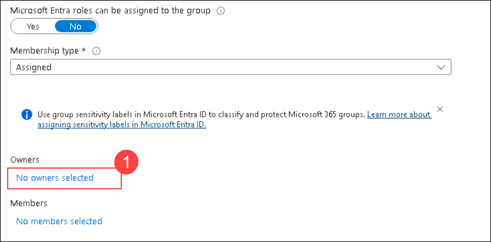

# Module 1 - Lab 1 - Explore Microsoft Defender XDR

## Lab Scenario
 You are a Security Operations Analyst working at a company that is implementing Microsoft Defender XDR. You start by assigning preset security policies in EOP and Microsoft Defender XDR for Office 365.

## Lab Objectives

In this lab, you will perform:
- Task 1: Create a Group in Microsoft Entra ID
- Task 2: Apply Microsoft Defender XDR for Office 365 present security policies
    
## Estimated timing: 60 minutes

## Architecture Diagram

  

### Task 1: Create a Group in Microsoft Entra ID

In this task, you will create a new group in Microsoft Entra ID using the Azure portal.

1. In the Search bar of the Azure portal, type **Microsoft Entra ID**, then select **Microsoft Entra ID**.

1. Select **Groups** and then click on **New group**.

1. Enter the below details for the new group page:

   |Setting|Value|
    |---|---|
    |Group Type| **Microsoft 365 (1)** |
    |Group Name| **Sg-IT-<inject key="DeploymentID" enableCopy="false"/> (2)**|

   

1. Click on **No owners selected (1)** and  select the **ODL_user <inject key="DeploymentID" enableCopy="false"/>** from the list and then click on **Select**.

   

1. Click on **No members selected** and select the **ODL_user <inject key="DeploymentID" enableCopy="false"/>** from the list and then click on **Select**.

   > **Note**: Make sure you have selected **Group type** as Microsoft 365.

1. Select **Create**.

### Task 2: Apply Microsoft Defender XDR for Office 365 preset security policies

In this task, you will assign preset security policies for Exchange Online Protection (EOP) and Microsoft Defender XDR for Office 365 in the Microsoft  security portal.

1. In the Edge browser, go to the Microsoft  Defender XDR portal at (https://security.microsoft.com).

1. You'll see the **Sign into Microsoft Defender XDR portal** tab. Here, enter your credentials to log in:
 
   - **Email/Username:** <inject key="AzureAdUserEmail"></inject>
 
      
 
1. Next, provide your password to continue:
 
   - **Password:** <inject key="AzureAdUserPassword"></inject>
 
      

    >**Note:** If you see the message **"The operation could not be completed. Please try again later. If the issue persists, contact Microsoft Support."**, click **OK** to proceed.

1. If shown, close the **Microsoft Defender XDR quick tour** to proceed.

1. From the navigation menu, under *Email & Collaboration* area, select **Policies & rules**.

1. On the *Policy & rules* dashboard, select **Threat policies**.

1. On the *Threat policies* dashboard, select **Preset Security Policies**.

    >**Note:** If you see the message *"Client Error - An error occurred when retrieving preset security policies. Please try again later."*, select **OK** to continue, then refresh your browser by pressing **Ctrl+F5**.

1. On the **Learn about preset security policies** *pop-out* page, select **Cancel**.

1. Under **Standard protection**, select **Manage protection settings**. 

   

    >**Hint:** If you see this option greyed out, refresh your browser by pressing **Ctrl+F5**.

    >**Note:** After clicking on **Manage protection settings**, the content may take **40 to 60 minutes** to load completely. Wait for the page to fully load, then return to the same page after the waiting period. You may need to sign out of **Microsoft Defender XDR**, sign back in, and then repeat the steps to continue.

1. In the Apply Exchange Online Protection page, select **Specific recipients** under **Apply protection to:** and under **Domains** you can see that your domain is selected **(1)**, if not start writing your tenant's domain name, select it, and then select **Next (2)**.

                                                                       
    >**Hint:** The domain name for your tenant is the same as your admin account, usually in the format *mocholxxxxx.onmicrosoft.com*. This setup enforces policies for anti-spam, outbound spam filtering, anti-malware, and anti-phishing.

1. In the **Apply Defender for Office 365 protection** page, apply the same configuration as the previous step and select **Next**. Notice that this configuration applies policies for anti-phishing, Safe Attachments, and Safe Links.

1. In the *Impersonation protection* page, select **Next** for next all steps i.e. (4x times) to continue.

1. If a popup appears for *Policy mode* page, make sure the **Turn on the policy when finished** radio button is selected, and then select **Next**.

1. Read the content under *Review and confirm your changes* and select **Confirm** to apply the changes and then select **Done** to finish.

1. Under **Strict protection**, select **Manage protection settings**. **Hint:** *Strict protection* is found under "Email & Collaboration - Policies & rules - Threat policies - Preset security policies".

1. In the *Apply Exchange Online Protection* page, select **Specific recipients** and under **Groups** start writing **Sg-IT-<inject key="DeploymentID" enableCopy="false"/>**, select it, and then select **Next**. Notice that this configuration applies policies for anti-spam, outbound spam filters, anti-malware, and anti-phishing.

   >**Note**: If a group is already selected, make sure it is **Sg-IT-<inject key="DeploymentID" enableCopy="false"/>**. If it is not, remove the selected group and add the correct one.

1. In the *Apply protection to* page, apply the same configuration as the previous step and select **Next**. Notice that this configuration applies policies for anti-phishing, Safe Attachments, and Safe Links.

1. In the *Impersonation protection* page, select **Next** for next all steps i.e. (4x times) to continue.

1. In the *Policy mode* page, make sure the **Turn on the policy when finished** radio button is selected, and then select **Next**.

1. Read the content under *Review and confirm your changes* and select **Confirm** to apply the changes and then select **Done** to finish.

   > **Congratulations** on completing the task! Now, it's time to validate it. Here are the steps:
   > - Hit the Validate button for the corresponding task. You can proceed to the next task if you receive a success message.
   > - If not, carefully read the error message and retry the step, following the instructions in the lab guide.
   > - If you need any assistance, please contact us at labs-support@spektrasystems.com. We are available 24/7 to help you out.

   <validation step="cd91c5ce-77b6-4769-8216-ebe3792185a5" />

### Review
 In this lab, you have completed the following:

   - Created a Group in Microsoft Entra ID
   - Applied Microsoft Defender XDR for Office 365 preset security policies

## You have successfully completed the lab
