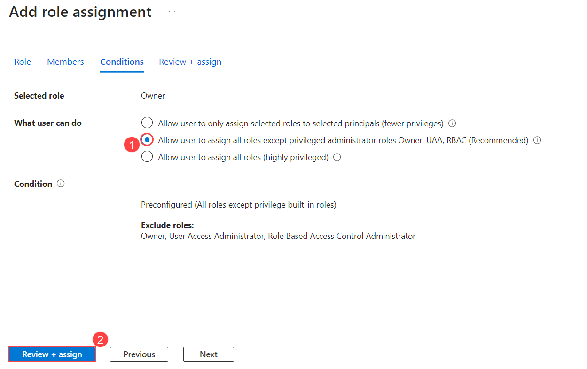
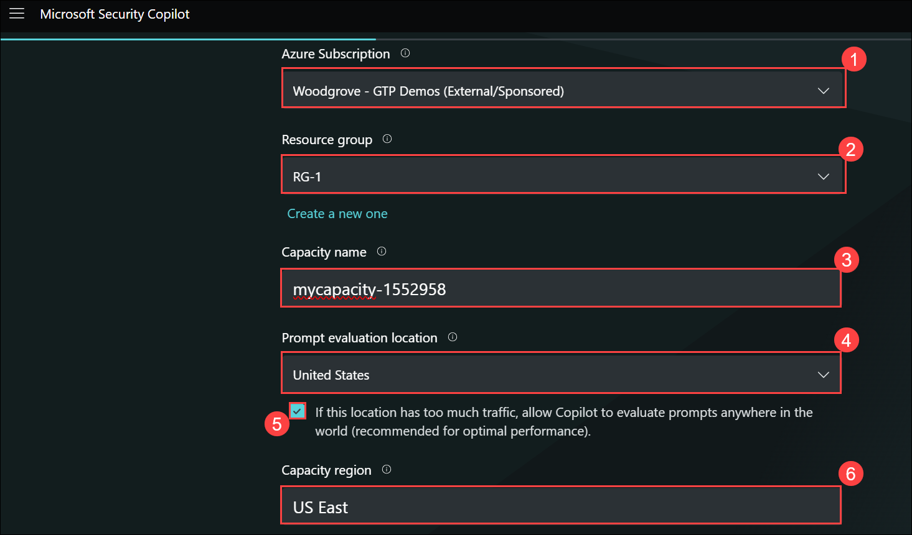
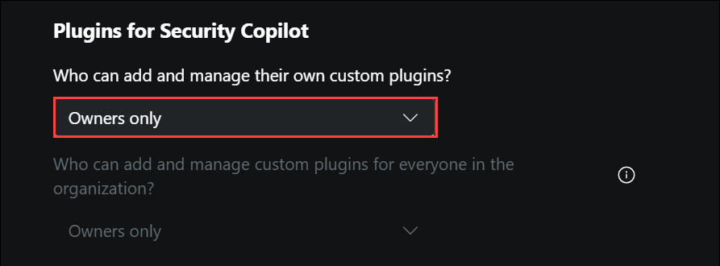
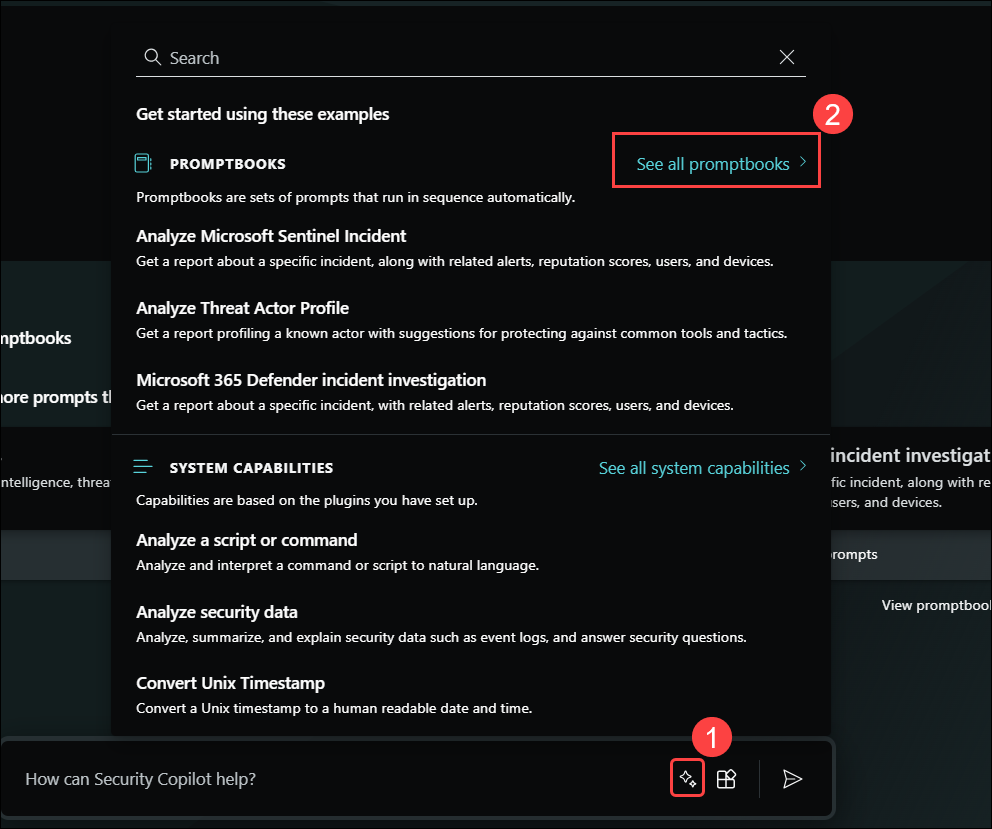
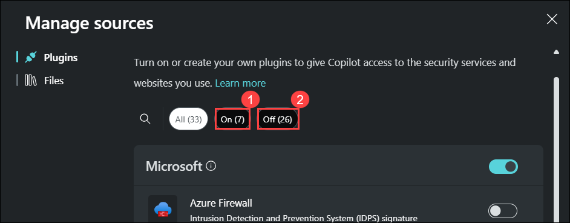
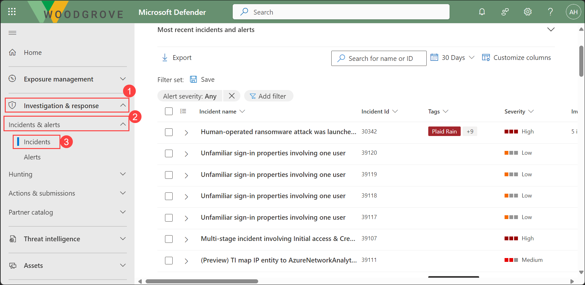
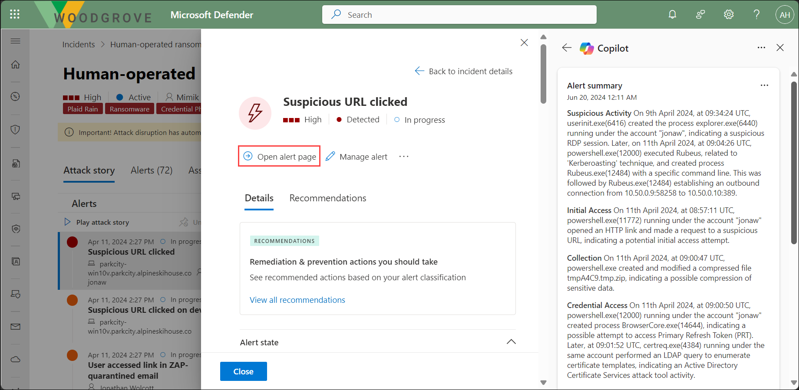
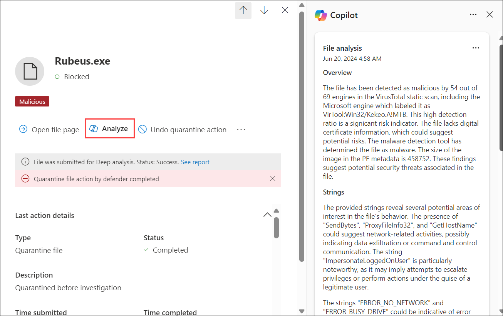
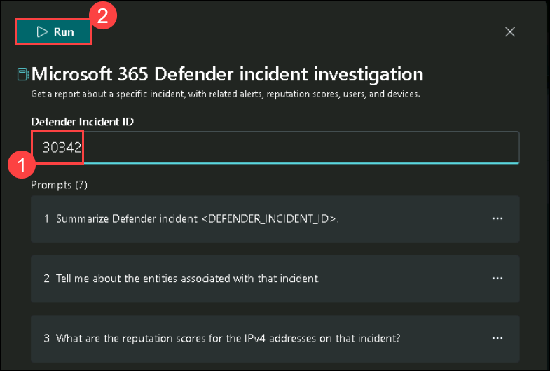

# Module 2 - Lab 1 - Exercise 1 - Explore Microsoft Security Copilot

## Lab scenario

The organization you work for wants to increase the efficiency and capabilities for its security operations analysts, and to improve security outcomes. In support of that objective, the office of the CISO determined that deploying Microsoft Security Copilot is a key step towards that objective. As a Security administrator for your organization, you're tasked with setting up Copilot.

In this exercise, you go through the *first run experience* of Microsoft Security Copilot to provision Copilot with one security compute unit (SCU).

## Lab objectives
In this lab, you will perform:
- Task 1: Provision Microsoft Security Copilot
- Task 2: Explore the Microsoft Security Copilot standalone experience
- Task 3: Explore the Microsoft Security Copilot embedded experience

## Estimated timing: 45 minutes

## Architecture Diagram

 

### Task 1: Provision Microsoft Security Copilot

For this exercise, you're logged in as Avery Howard and you have the global administrator role in Microsoft Entra. You'll work in both the Azure portal and Microsoft Security Copilot.

This exercise should take approximately **15** minutes to complete.

In this task, you walk through the process of ensuring you have the appropriate role permissions. This starts by enabling access management for Azure resources.

1. In the Search bar of the Azure portal, type **Microsoft Entra ID**, then select **Microsoft Entra ID**.

1. From the left navigation panel, expand **Manage**.

1. From the left navigation panel, scroll down and select **Properties (1)**.

1. Enable the toggle switch for **Access management for Azure resources (2)**, then select **Save (3)**.

   

   >**Note**: If Access Management for Azure resources is already enabled, proceed to the next step.

1. From the blue banner on the top of the page, select **Microsoft Azure** to return to the landing page of the Azure portal.

1. Select **Subscriptions** then select the subscription listed.

   
     
1. Select **Access control (IAM) (1)**.

1. Select **+ Add (2)**, then **Add role assignment (3)**.

   

1. From the Role tab, select **Privileged administrator roles (1)**.

1. Select **Owner (2)**, then select **Next (3)**.

   

1. Select **+ Select members (1)**.

1. Avery Howard is the first name on this list, select the **+** to the right of the name.  Avery Howard (2) is now listed under selected members. Select the **Select (3)** button, then select **Next (4)**.

   

1. Select **Allow user to assign all roles except privileged administrator roles, Owner, UAA, RBAC (Recommended) (1)**.

1. Select **Review + assign (3)**, then select **Review + assign** one last time.

   

1. Open a new tab and access the simulated environment by clicking on the following link: **[Microsoft Security Copilot](https://app.highlights.guide/start/6373500f-1f10-4584-a14e-ca0b4aa7399f?link=0&token=40f793d4-2956-40a4-b11a-6b3d4f92557f&azure-portal=true)**.

1. Follow the steps in the Wizard, select **Get started**.

   

1. On this page, you set up your security capacity. For any of the fields listed below, you can select the information icon for more information.
   - Azure subscription: From the drop-down, select **Woodgrove - GTP Demos (External/Sponsored) (1)**.
   - Resource group: From the drop-down, select **RG-1 (2)**.
   - Capacity name: Enter **Mycapacity-<inject key="DeploymentID" enableCopy="false"></inject> (3)**
   - Prompt evaluation location [Geo]: From the drop-down, select **United Status (4)**.
   - You can choose whether you want to select the option, "If this location has too much traffic, allow Copilot to evaluate prompts anywhere in the world (recommended for optimal performance) (5).
   - **Capacity region (6)** is set based on location selected.

     

   - **Security compute:** This field is automatically populated with the minimum required SCU units, which is 1. Leave  field with the value of **1 (1)**.
   - Select the box, **"I acknowledge that I have read, understood, and agree to the Terms and Conditions (2)**.
   - Select **Continue (3)** on the bottom right corner of the page.

     

1. The wizard displays information about where your customer data will be stored. The region displayed is based on the region you selected in the Prompt evaluation field. Select **Continue**.

   

1. You can select options to help improve Copilot. You can select the toggle based on your preferences.  Select **Continue**.

   

1. As part of the initial setup, Copilot provides contributor access to everyone by default and includes Global administrators and Security administrators as Copilot owners. In your production environment, you can change who has access to Copilot, once you've completed the initial setup. Select **Continue**.

   

1. You're all set! Select **Finish**.

   

1. Close the browser tab, as the next exercise will use a separate link to the lab-like environment.

### Task 2: Explore the Microsoft Security Copilot standalone experience

The security administrator for your organization provisioned Copilot. Since you're the senior analyst on the team, the administrator added you as a Copilot owner and asked you to familiarize yourself with the solution.

In this exercise, you explore all the key landmarks in the landing page of the standalone experience of Microsoft Security Copilot.

You're logged in as Avery Howard and have the Copilot owner role. You'll work in the standalone experience of Microsoft Security Copilot.

This exercise should take approximately **15** minutes to complete.

1. Open a new tab and access the simulated environment by clicking on the following link: : **[Microsoft Security Copilot](https://app.highlights.guide/start/2cac767e-42c4-4058-afbb-a9413aac461d?link=0&token=40f793d4-2956-40a4-b11a-6b3d4f92557f&azure-portal=true)**.

1. Select the **Menu** icon, which is sometimes referred to as the hamburger icon.

1. Select **My sessions** and note the available options.

   

1. Select recent to view the most recent sessions.

1. Select filter and note the available options, then close the filer.

1. Select the home menu icon to open the home menu.

1. Select **Promptbook library**.
 
   

1. Select My promptbooks. A subsequent task dives deeper into promptbooks.

   

1. Select Woodgrove.

   

1. Select Microsoft.

   

1. Select filter to view the available options, then select the X to close.

1. Select the home menu icon to open the home menu.

1. Select **Owner settings**. These settings are available to you as a Copilot owner. A Copilot contributor does have not access to these menu options.

   

1. For plugins for Security Copilot, select the drop-down for Who can add and manage their own custom plugins to view the available options.

1. Select drop-down for Who can add and manage custom plugins for everyone in the organization to view the available options. Note, this option is greyed out if Who can add and manage their own custom plugins is set to owners only.

   

1. Select the information icon next to "Allow Security Copilot to access data from your Microsoft 365 Services."  This setting must be enabled if you want to use the Microsoft Purview plugin. You'll work with this setting in a later exercise.

   

1. Select the drop-down for who can upload files to view the available options.

1. Select the home menu icon to open the home menu.

1. Select **Role assignment**.

   

1. Select Add members, then close.

   

1. Expand owner.

   

1. Expand contributor.

   

1. Select the home menu icon to open the home menu.

1. Select **Usage monitoring**.

   

1. Select the date filter to view available options.
      
   

1. Select the home menu icon to open the home menu.

1. Select **Settings**.

   

1. Select preferences. Scroll down to view available options.

1. Select data and privacy.

1. Select About.

1. Select the X to close the preferences window.

1. Select where it says **Woodgrove** at the bottom left of the home menu.

   

1. When you select this option, you see your tenants. This is referred to as the tenant switcher. In this case, Woodgrove is the only available tenant.

1. Select the **Home** to return to the landing page.

1. The largest card is your last session. Selecting the title of any session card takes you to that session.

1. Select **View all sessions** to go to the My sessions page.

1. Select **Microsoft Copilot for Security**, next to the home menu icon, to return to the landing page.

1. To the right of where it says "Get started with these promptbooks" are a left and right arrow key that allows you to scroll through the tiles for Microsoft security promptbooks. Select the **right arrow >**

   

1. Each tile shows the title of the promptbook, a brief description, the number of prompts, and a run icon. Select the title of any of the promptbook tiles to open that promptbook. Select **Vulnerability impact assessment**, as an example.

   

1. The window for the selected promptbook provides information, including who created the promptbook, tags, a brief description, inputs required to run the promptbook, and a listing of the prompts.

1. Note the information about the promptbook and the available options. For this simulation you can't start a new session, you'll do that in a subsequent exercise. 

1. Select **X** to close the window.

1. Select **View the promptbook library**.

    

1. To view promptbooks that you own, select My promptbooks.

1. Select Woodgrove for a listing of promptbooks owned by Woodgrove, the name of a fictitious organization.

1. To view built-in, Microsoft owned/developed promptbooks, select Microsoft.

1. Select the filter icon. Here you can filter based on tags assigned to the workbook. Close the filter window by selecting the X in the New filter tab.

1. Select **Microsoft Copilot for Security**, next to the home menu icon, to return to the landing page.

1. From the prompt bar, you can select the prompts icon to select a built-in prompt or a promptbook. Select the **prompts icon**.
     
1. Select **See all promptbooks**

   

1. Scroll to view all the available promptbooks.
       
1. Select the **back-arrow** next to the search bar to go back.

   

1. Select **See all system  capabilities**. The list shows all available system capabilities (these capabilities are in effect prompts that you can run). Many system capabilities are associated with specific plugins and as such will only be listed if the corresponding plugin is enabled.

   

1. Scroll to view all the available promptbooks.

1. Select the **back-arrow** next to the search bar to go back.

1. Select the **sources icon**.

   

1. The sources icon opens the manage sources window. From here, you can access Plugins or Files. The **Plugins** tab is selected by default.

1. Select whether you want to view all plugins, those that are enabled (on), or those that are disabled (off).

   

1. Expand/collapse list of Microsoft, non-Microsoft, and custom plugins.
        
1. Some plugins require configuring parameters. Select the **Set up** button for the Microsoft Sentinel plugin, to view the settings window. Select **cancel** to close the settings window. In a separate exercise, you configure the plugin.

1. You should still be in the Manage sources window. Select **Files**.

1. Review the description.

1. Files can be uploaded and used as a knowledge base by Copilot. In a subsequent exercise, you'll work with file uploads.

1. Select **X** to close the manage sources window.

   

1. Select the **Help (?)** icon.

1. Select **Documentation**. This selection opens a new browser tab to the Microsoft Security Copilot documentation. Return to the Microsoft Security Copilot browser tab.

1. Select **Help**.

1. Anyone with access to Security Copilot can access the self help widget by selecting the help icon then selecting the Help tab. Here you can find solutions to common problems by entering something about the problem.

1. Users with a minimum role of Service Support Administrator or Helpdesk Administrator role can submit a support case to the Microsoft support team. If you have this role, a headset icon is displayed. Close the contact support page.

   

### Task 3: Explore the Microsoft Security Copilot embedded experience

In this exercise, you investigate an incident in Microsoft Defender XDR. As part of the investigation, you explore the key features of Microsoft Copilot in Microsoft Defender XDR, including incident summary, device summary, script analysis, and more. You also pivot your investigation to the standalone experience and use the pin board as a way to share details of your investigation with your colleagues.

You're logged in as Avery Howard and have the Copilot owner role. You'll work in Microsoft Defender, using the new unified security operations platform, to access the embedded Copilot capabilities in Microsoft Defender XDR. Towards the end of the exercise, you pivot to the standalone experience of Microsoft Security Copilot.

This exercise should take approximately **30** minutes to complete.

1. Open the simulated environment by selecting this link: **[Microsoft Defender portal](https://app.highlights.guide/start/f4f590f6-8937-40f9-91ec-632de546ab98?token=40f793d4-2956-40a4-b11a-6b3d4f92557f&azure-portal=true)**.

1. From the Microsoft Defender portal:

   - Expand **Investigation & response**.
   - Expand  **Incidents & alerts**.
   - Select **Incidents**.

     

1. Select the first incident in the list, **Incident Id: 30342** named Human-operated ransomware attack was launched from a compromised asset (attack disruption).

   

1. This is a complex incident. Defender XDR provides a great deal of information, but with 72 alerts it can be a challenge to know where to focus. On the right side of the incident page, Copilot automatically generates an **Incident summary** that helps guide your focus and response. Select **See more**.

   

1. Copilot's summary describes how this incident has evolved, including initial access, lateral movement, collection, credential access and exfiltration. It identifies specific devices, indicates that the PsExec tool was used to launch executable files, and more.

1. These are all items you can leverage for further investigation. You explore some of these in subsequent tasks.

1. Scroll down on the Copilot panel and just beneath the summary are **Guided responses**. Guided responses recommend actions in support of triage, containment, investigation, and remediation.

1. The first item in the triage category it to Classify this incident. Select **Classify** to view the options. Review the guided responses in the other categories.

1. Select the **Status** button at the top of the guided responses section and filter on **Completed**. Two completed activities show labeled as Attack Disruption. Automatic attack disruption is designed to contain attacks in progress, limit the impact on an organization's assets, and provide more time for security teams to remediate the attack fully.

   

1. Keep the incident page open, you'll use it in the next task.

1. From the incident page, select the first alert **Suspicious URL clicked**.

1. Copilot  automatically generates an **Alert summary**, which provides a wealth of information for further analysis. For example, the summary identifies suspicious activity, it identifies data collection activities, credential access, malware, discovery activities, and more.

   

1. There's a lot of information on the page, so to get a better view of this alert, select **Open alert page**. It's on the third panel on the alert page, next to the incident graph and below the alert title.

   

1. On the top of the page, is card for the device parkcity-win10v. Select the ellipses and note the options. Select **Summarize**. Copilot generates a **Device summary**. It's worth nothing that there are many ways you can access device summary and this is just one convenient method. The summary shows the device is a VM, identifies the owner of the device, it shows its compliance status against Intune policies, and more.

1. Next to the device card is a card for the owner of the device. Select **parkcity\jonaw**. The third panel on the page updates from showing details of the alert to providing information about the user Jonathan Wolcott, an account executive, whose Microsoft Entra ID risk and Insider risk severity are classified as high. These aren't surprising given what you've learned from the Copilot incident and alert summaries. Select the ellipses then select  **Summarize** to obtain an identity summary generated by Copilot.

1. Keep the alert page open, you'll use it in the next task.

1. Let's Focus on the alert story. Select **Maximize**, located on the main panel of the alert, just beneath the card labeled 'partycity\jonaw' to get a better view of the process tree. From maximized view, you begin to get a clearer view of how this incident came to be. Many line items indicate that powershell.exe executed a script. Since the user Jonathan Wolcott is an account executive, it's reasonable to assume that executing PowerShell scripts isn't something this user is likely to be doing regularly.

1. Expand the first instance of **powershell.exe execute a script**, it's the one showing the timestamp of 2:27:11 PM. Copilot has the capability to analyze scripts. Select **Analyze**.

   

1. Copilot generates an analysis of the script and suggests it could be a phishing attempt or used to deliver a web-based exploit.

1. Select **Show code**. The code shows a defanged URL.

1. There are several other items that indicate powershell.exe executed a script. Expand the one labeled **powershell.exe -EncodedCommand...** . The original script was base 64 encoded, but Defender has decoded that for you. For the decoded version, select **Analyze**. The analysis highlights the sophistication of the script used in this attack.

   

1. Close the alert story page by selecting the **X** (the X that is to the left of Copilot panel). Now use the breadcrumb to return to the incident. Select **Human-operated ransomware attack was launched from a compromised asset (attack disruption)**.

1. You're back at the incident page. In the alert summary, Copilot identified the file Rubeus.exe, which is associated with the 'Kekeo' malware. You can use the file analysis capability in Defender XDR to see what other insights you can get. There are several ways to access files. From the top of the page, select the **Evidence and Response** tab.

1. From the left side of the screen select **Files**.

1. Select the first item from the list with the entity named **Rubeus.exe**.

1. From the window that opens, select **Analyze(1)**. Copilot generates a summary.

   

1. Review the detailed file analysis that Copilot generates.

1. Close the file analysis window.

1. Return to the incident page by selecting the **Attack story** tab from the top of the page.

1. Select the ellipses next to Copilot's Incident summary and select **Open in Copilot for Security**.

1. Copilot opens in the standalone experience and shows the incident summary. You can also run more prompts. In this case, you'll run the promptbook for an incident. Select the **prompt icon**. 

1. Select **See all promptbooks**.

1. Select **Microsoft 365 Defender incident investigation**.

1. The promptbook page opens and asks for the Defender Incident ID. Enter **30342 (1)** then select **Run (2)**.

   

1. Review the information provided. By pivoting to the standalone experience and running the promptbook, the investigation is able to invoke capabilities from a broader set security solution, beyond just Defender XDR, based on the plugins enabled.

1. Select the **box icon (1)** next to the pin icon to select all the prompts and and the corresponding responses, then select the **Pin icon (2)** to save those responses to the pin board.

1. The pin board opens automatically. The pin board holds your saved prompts and responses, along with a summary of each one. You can open and close the pin board by selecting the **pin board icon**.

1. From the top of the page, select **Share (3)** to view your options. By sharing the incident via a link or email, people in your organization with Copilot access can view this session. Close the window by selecting the **X**.

   

1. You can now close the browser tab to exit the simulation.

## Summary and additional resources

In this exercise, you explored the first run experience of Microsoft Security Copilot, provisioned capacity, and explored the standalone and embedded experiences of Copilot. You investigated an incident in Microsoft Defender XDR, explored the incident summary, device summary, script analysis, and more. You also pivoted your investigation to the standalone experience and used the pin board as a way to share details of your investigation with your colleagues.

To run additional Microsoft Security Copilot use case simulations, browse to [Explore Microsoft Security Copilot use case simulations](/training/modules/security-copilot-exercises/)

### Review
 In this lab, you have completed the following:
   - Provisioned Microsoft Security Copilot
   - Explored the Microsoft Security Copilot standalone experience
   - Explored the Microsoft Security Copilot embedded experience

## You have successfully completed the lab.
