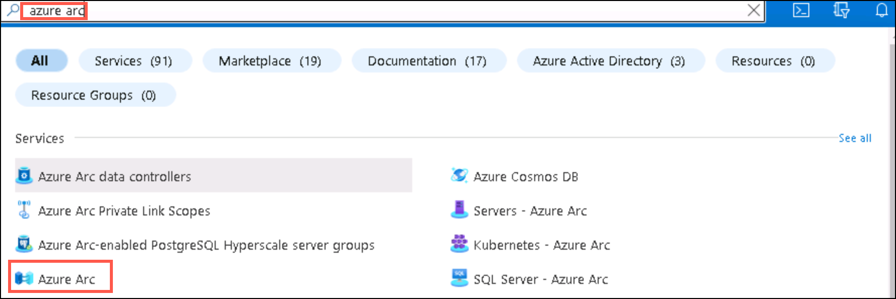
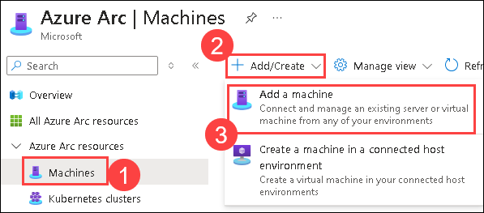
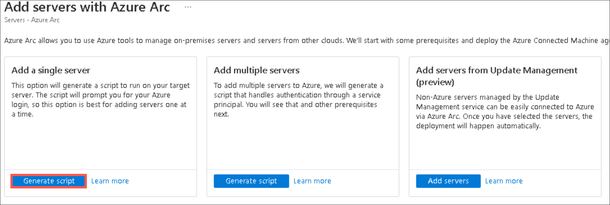
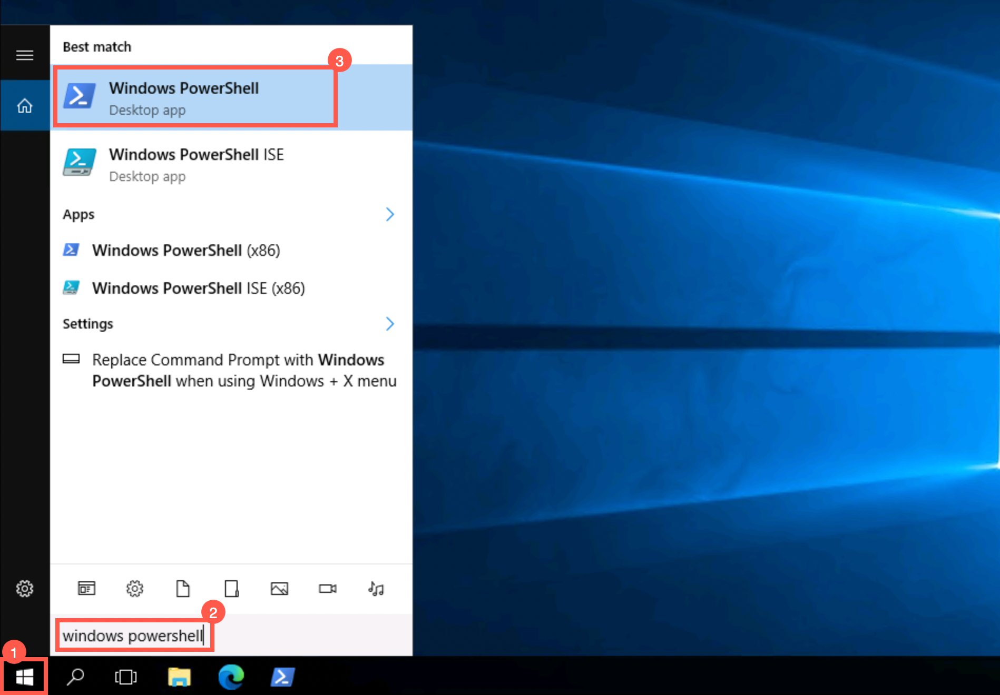

# Lab 02: Enable Microsoft Defender for Cloud

### Estimated Duration: 40 minutes

## Lab scenario

You're a Security Operations Analyst working at a company that is implementing cloud workload protection with Microsoft Defender for Cloud.  In this lab, you will enable Microsoft Defender for Cloud.

## Lab objectives

In this lab, you will perform the following:

- Task 1: Create a Log Analytics Workspace
- Task 2: Enable Microsoft Defender for Cloud
- Task 3: Install Azure Arc on an On-Premises Server
- Task 4: Protect an On-Premises Server

## Architecture Diagram

  

### Task 1: Create a Log Analytics Workspace

In this task, you will create a Log Analytics workspace for use with Microsoft Defender for Cloud.

1. In the Search bar of the Azure portal, type **Log Analytics**, then select **Log Analytics workspaces**.

1. Click on **+ Create** from the command bar.

1. Provide the following details and click on **Review + Create (4)**:
    
     - Resource group: Select **RG-Defender (1)**
     - Name: Provide **uniquenameDefender (2)**  
     - Region: Keep the **default (3)**

1. Once the workspace validation has passed, select **Create**. Wait for the new workspace to be provisioned.

### Task 2: Enable Microsoft Defender for Cloud

In this task, you'll enable and configure Microsoft Defender for Cloud.

1. In the Search bar of the Azure portal, type *Defender*, then select **Microsoft Defender for Cloud**.

1. In the left menu for Microsoft Defender for Cloud, under Management, select **Environment settings (1)** and select your **Subscription (2)** by expanding the Tenant Group.

1. Review the Azure resources that are now protected with the Defender for Cloud plans.

    >**Important:** If all Defender plans are *Off*, select **Enable all plans**. Select the *Turn on the plan anyways* and then click on **OK**. Select **Save** at the top of the page and wait for the *"Defender plans (for your) subscription were saved successfully!"* notifications to appear.

1. Select the **Settings & monitoring** tab from the Settings area (next to Save).

1. Review the monitoring extensions. It includes configurations for Virtual Machines, Containers and Storage Accounts. Close the "Settings & monitoring" page by selecting the 'X' on the upper right of the page.

1. Close the settings page by selecting the 'X' on the upper right of the page to go back to the **Environment settings** and select the '>' to the left of your subscription.

1. Select the **uniquenameDefender** Log Analytics workspace you created earlier to review the available options and pricing.

1. Close the Defender plans page by selecting the 'X' on the upper right of the page to go back to the **Environment settings**

### Task 3: Install Azure Arc on an On-Premises Server

In this task, you will install Azure Arc on an on-premises server to make onboarding easier.

>**Important:** The next steps are done on a different machine than the one you were previously working on. Look for the Virtual Machine name references.

1. In the Search bar of the Azure portal, Search for **Virtual Machines** and select it.

1. Select the **WIN1-<inject key="DeploymentID" enableCopy="false" />** VM.

1. Click on **Connect** from the Connect dropdown.

1. Click on **Download RDP file** and select **Keep** in the pop-up.

1. Click on **Connect**.

1. Navigate to the **Environment** Details tab and copy the password which is listed under **Resource Group: WIN-1**.

1. Paste it in the login pop-up and click on **OK**.

1. Click on **Yes**.

1. Click on the Start button, search for **Hyper-V** from the bottom windows search bar, and select to open.

1. Click on **WIN1-<inject key="DeploymentID" enableCopy="false" />**.

1. Select and right-click on the **WINServer** virtual machine from the virtual machine section in the middle and select start, then again right-click on the **WINServer** virtual machine and select **connect**.

1. It asks you to press ctrl+alt+dlt, Go-to **actions** in the top of VM toolbar and click on **ctrl+alt+dlt** (**Skip if not asked**)

1. Enter the **Password** as `Password.1!!` when prompted.

     > **Note:** To enable the clipboard Right-click on WIN1-xxxx and select Hyper-V Settings click on **enhanced session mode** and check the **use enhanced mode** click on apply Then restart your virtual machine, once vm starts you will get a configuration pop-up click on show more options and select local resources and make sure the clipboard is selected

1. Open the Microsoft Edge browser and navigate to the Azure portal at https://portal.azure.com.

1. In the **Sign in** dialog box, provide the credentials as listed below:

    * Azure Username/Email: <inject key="AzureAdUserEmail"></inject> 
    * Azure Password: <inject key="AzureAdUserPassword"></inject>

1. Click on **Yes** on the Stay signed in dialog box.

1. In the **search resources, services and docs bar**, type **Azure arc** and select it from suggestions, as shown below:
   
    
  
1. On the **Azure Arc** page, select **Machines (1)** under **Azure Arc Resources**, click on **+Add/create (2)** and then **Add a Machine (3)**.
    
    
    
1. In the **Add servers with Azure Arc** page, click **Generate script** under **Add a single server**.

    

1. Under the **Basics** tab, fill in the following details:
     
   - Subscription: **Select your subscription**
    
   - Resource group: **RG-Defender (1)**
  
   - Region: Select **EAST US**
   
   - Operating system: **Windows (3)**

   - Leave other values as default and Click on **Download and run script (4)**

1. Scroll down and select the **Download** button.

   > **Note:** Select **Keep** when prompted in the pop-up.

1. From the **Start (1)** menu of the AzureArcVM, search for **Windows Powershell (2)** and open it **(3)**.

    

1. Run the below command:

    ```
    cd C:\Users\Administrator\Downloads
    ```

      > **Important:** If you do not have this directory, it most likely means that you are on the wrong machine. Go back to the beginning of Task 4 change to WINServer and start over.

1. In PowerShell, run the below command to set the execution policy as unrestricted.

    ```
    Set-ExecutionPolicy -ExecutionPolicy unrestricted
    ```

1. Enter **A** for Yes to All and press enter.

1. Run the below command and press enter:  

    ```
    .\OnboardingScript.ps1
    ```

    >**Important:** If you get the error *"The term .\OnboardingScript.ps1 is not recognized..."*, make sure you are doing the steps for Task 4 in the WINServer virtual machine. Other issues might be that the name of the file changed due to multiple downloads, search for *".\OnboardingScript (1).ps1"* or other file numbers in the running directory.

1. Enter **R** to Run once and press enter (this may take a couple of minutes).

1. The setup process will open a new Edge browser tab to authenticate the Azure Arc agent. Select the ODL Account, wait for the message "Authentication complete" and then go back to the Windows PowerShell window.

1. When the installation finishes, go back to the Azure portal page where you downloaded the script and select **Close**. Close the **Add servers with Azure Arc** to go back to the Azure Arc **Machines** page.

1. Select **Refresh** until WINServer server name appears and the Status is *Connected*.

    >**Note:** This could take a couple of minutes.

### Task 4: Protect an On-Premises Server

In this task, you will manually install the required agent on the Windows Server.

1. Search **Data Collection Rules** on azure portal search bar.

    

1. Select **+ Create**.

1. Provide the following details and click on **Next:Resources (3)**:

   - Rule Name: Enter **WINServer (1)**
   - Resource Group: Select **RG-Defender (2)**
   - Keep the default region
   - Ensure the box for **Windows** is checked under Platform Type

1. In the **Resources** tab, click on **+ Add resources (1)**. In the **Select a scope** page, expand the *Scope* column for **RG-Defender**, then select **WINServer (Azure Arc) (2)** and select **Apply (3)**.

    >**Note:** You may need to set the column filter for *Resource type* to *Server-Azure Arc* if **WINServer (Azure Arc)** is not displayed.

1. Click on **Next: Collect and deliver**

1. In the **Collect and deliver** tab, select **+ Add data source (1)**. In the **Add a data source** page, select **Performance Counters (2)** from *Data source type*.

1. Click the **Destination** tab, select **+ Add Destination (1)**. Select **Azure Monitor Logs (2)** in the **Destination Type** dropdown. Select your **workspace (3)** from the drop down. Click on **Add data source (4)**.

1. Click on **Review + Create** and select **Create** after *Validation passed* is displayed.

      > **Note:** The **Data Collection Rule** creation initiates the installation of the *AzureMonitorWindowsAgent* extension on **WINServer (Azure Arc)**.

1. In the *Search resources, services and docs* search bar, search for **Azure Arc**. 

1. Select the **WINServer** which is associated with the **RG-Defender** resource group.

1. Select **Extensions** from the left pane under Settings.

1. The **AzureMonitorWindowsAgent** should be listed with a *Status* of **Succeeded**.

### Summary

In this lab, you have completed the following:

- Created a Log Analytics Workspace
- Enabled Microsoft Defender for Cloud
- Installed Azure Arc on an On-Premises Server.
- Protected an On-Premises Server

### You have successfully completed the lab!
