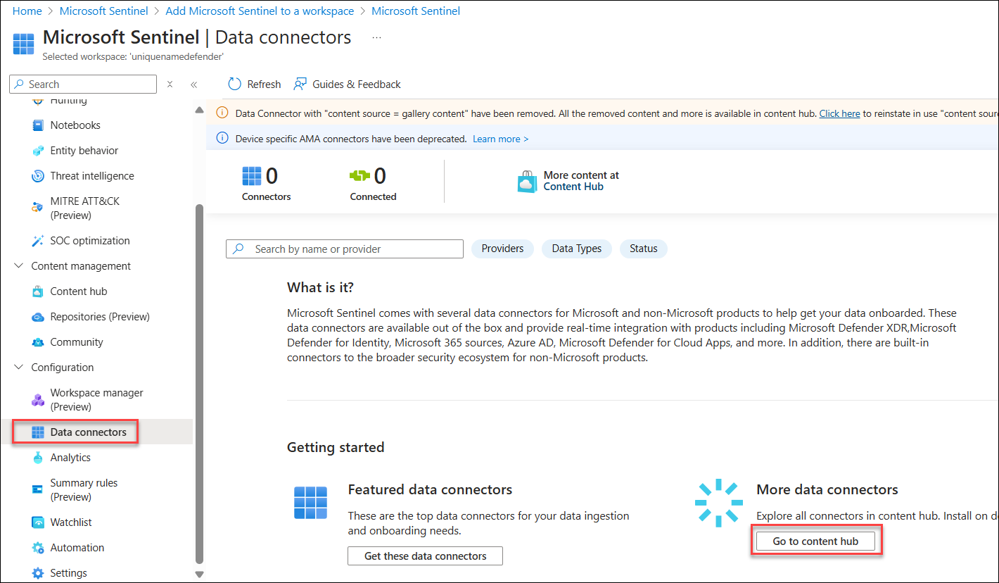

# Lab 04: Connect data to Microsoft Sentinel using data connectors

## Lab scenario

You are a Security Operations Analyst working at a company that implemented Microsoft Sentinel. You must learn how to connect log data from the many data sources in your organization. The organization has data from Microsoft 365, Microsoft 365 Defender, Azure resources, non-azure virtual machines, and network appliances.

You plan on using the Microsoft Sentinel data connectors to integrate the log data from various sources. You need to write a connector plan for management that maps each of the organization's data sources to the proper Microsoft Sentinel data connector.

## Lab objective

After completing this lab, you will be able to integrate log data from various data sources within the organization into Microsoft Sentinel using appropriate data connectors.

## Estimated timing: 40 minutes

## Architecture Diagram

  

### Task 1: Connect the Microsoft Entra ID connector

 In this task, you will connect the Microsoft Entra ID connector to Microsoft Sentinel.

 1. In the Search bar of the Azure portal, type **Sentinel**, then select **Microsoft Sentinel**.

    

 1. Select **+Create** from the command bar.

 1. Select **uniquenameDefender** and click on **Add**.

    

 1. On the left side menu, in the Configuration area select **Data connectors**.
 
 1. In the Data Connectors page, click on **content hub** and search for **Microsoft Entra ID** and select and install it.

    
    
   
 1. Go back to data connector page and search for the **Microsoft Entra ID** connector and select it from the list.

 1. Navigate back to the **Data connectors** page and select the **Open connector page** on the connector information blade.

    

 1. Check and click on the **Sign-in Logs** and **Audit Logs** options from the Configuration area, then select **Apply Changes**.

### Task 2: Connect the Microsoft Entra ID Protection connector

In this task, you will connect the Microsoft Entra ID Protection connector to Microsoft Sentinel.

1. In the Data Connectors page, click on content hub and search for **Microsoft Entra ID Protection** and select and **install** it.

    
 
1. From the Data Connectors Tab, search for the **Microsoft Entra ID Protection** connector and select it from the list.

1. Select the **Open connector page** on the connector information blade.

    

1. From the **Configuration** area select the **Connect** button.

### Task 3: Connect the Microsoft Defender for Cloud connector

In this task, you will connect the Microsoft Defender for Cloud connector.
 
1. In the Data Connectors page, click on content hub and search for **Microsoft Defender for Cloud** and select and **install** it.

    
 
1. From the Data Connectors tab, search for the **Microsoft Defender for Cloud** connector and select it from the list.

    >**Note:** The Microsoft Defender for Cloud solution installs the Subscription-based Microsoft Defender for Cloud (Legacy) Data connector, the Tenant-based Microsoft Defender for Cloud (Preview) Data connector, and an Analytics rule.

1. Select the **Subscription-based Microsoft Defender for Cloud (Legacy)** Data connector, and select the **Open connector page** on the connector information blade.

    

1. In the **Configuration** area, under Subscription, select the checkbox for the available subscription and slide the **Status** option to the right to indicate **Connected**.

1. The **Status** should be now **Connected** and **"Bi-directional sync"** should be **Enabled**.

    

### Task 4: Connect the Azure Activity connector

In this task, you will connect the Azure Activity connector.
1. In the Data Connectors page, click on content hub search for **Azure Activity**, and select and install it

    

1. From the Data Connectors Tab, search for the **Azure Activity** connector and select it from the list.

1. Select the **Open connector page** on the connector information blade.

    

1. In the Configuration area, scroll down and under "2. Connect your subscriptions..." select **Launch Azure Policy Assignment Wizard>**.

1. In the **Basics** tab, select the button with the three dots under **Scope** to select your subscription from the drop-down list and click **Select**.

1. Select the **Parameters** tab, choose your Microsoft Sentinel workspace from the **Primary Log Analytics workspace** drop-down list.

1. Select the **Remediation** tab and mark the **Create a remediation task** checkbox.

1. Select the **Review + Create** button to review the configuration.

1. Select **Create** to finish.

## Summary

In this lab, you have integrated log data from various data sources within the organization into Microsoft Sentinel using appropriate data connectors.

### You have successfully completed the lab!
