# Lab 05: Connect Linux hosts to Microsoft Sentinel using data connectors

### Estimated Duration: 40 minutes

## Lab scenario

You are a Security Operations Analyst working at a company that implemented Microsoft Sentinel. You must learn how to connect log data from the many data sources in your organization. The next source of data is Linux virtual machines using the Common Event Formatting (CEF) via Legacy Agent and Syslog connectors.

>**Important:** There are steps within the next Tasks that are done in different virtual machines. Look for the Virtual Machine name references.

## Lab objectives
In this lab, you will perform the following: 
- Task 1: Connect a Linux Host using the Common Event Format connector
- Task 2: Connect a Linux host using the Syslog connector
- Task 3: Configure the facilities you want to collect and their severities for the Syslog connector

## Architecture Diagram

  

## Task 1: Connect a Linux Host using the Common Event Format connector

In this task, you will connect a Linux host to Microsoft Sentinel with the Common Event Format (CEF) connector.

   > **Note:** Ensure you are logged into Azure from the SmartHotelHost VM (Jump VM).

1. In the Search bar of the Azure portal, type *Sentinel*, then select **Microsoft Sentinel**.

1. Click on the **uniquenameDefender (1)** workspace that we created earlier. Select **Content Hub (2)** under Content management from the left pane.

1. Search for **Common Event Format (3)** and select it.

1. Click on **Install (4)**.

     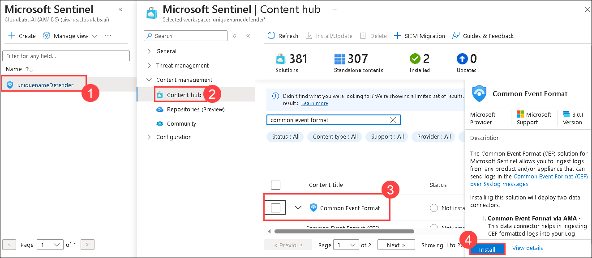

1. Once the **Common Event Format** is installed. Click on **Data connectors (1)** present under Configuration in the left pane.

1. From the Data Connectors tab, select **Common Event Format (CEF) via Legacy agent (2)** connector from the list.

1. Select the **Open connector page (3)** on the connector information blade.

     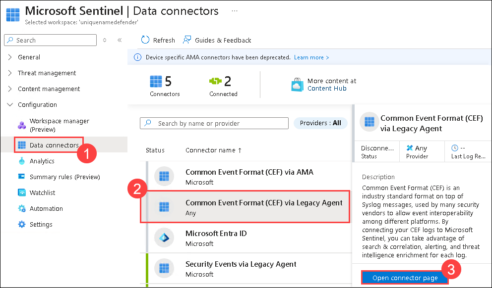

1. Under configuration, copy the command shown in **1.2 Install the CEF collector on the Linux machine** and paste it in a Notepad.

     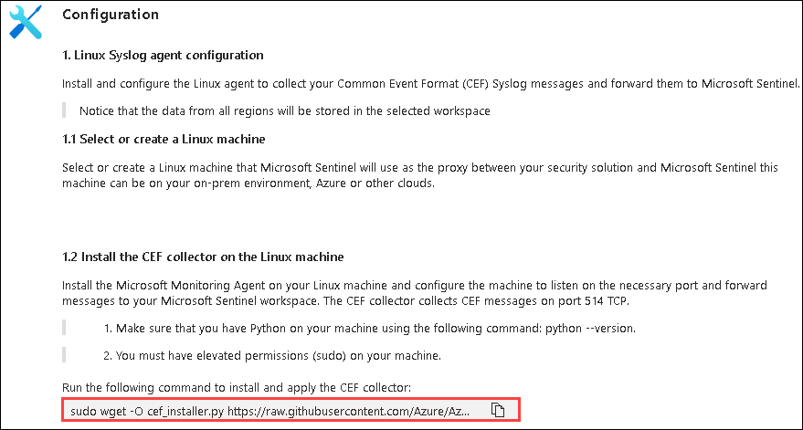

1. In the Search bar, type **virtual machine** and select **Virtual machine**.

1. Click on **LIN1** Linux virtual machine.

      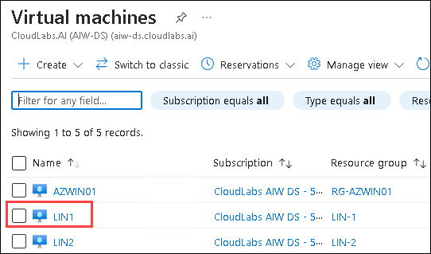  

1. Click on **Connect (1)** from the left navigation pane, scroll down and click on **Select (2)** under the Native SSH.
   
1. In the Native SSH pop-up window, **copy (3)** the command which is added under Copy and execute SSH command and paste it in a notepad.

      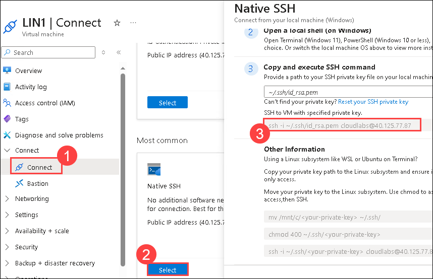  

1. Go back to the WIN1 virtual machine.

1. Launch Windows PowerShell as Administrator by right clicking the Start menu icon and selecting **Windows PowerShell (Admin)**.

1. Paste the command which we copied from the Native SSH window

1. Enter **yes** to confirm the connection and then type the user's **password provided under Resource group: LIN1** in the Environment tab and press **enter**. Your screen should look something like this:

   

1. Paste the **1.2 Install the CEF collector on the Linux machine** from the earlier step. 

   

1. The script will run against your Linux server remotely. When the script processes properly it should look like this screen:

   
   
1. Close the Powershell Window.

## Task 2: Connect a Linux host using the Syslog connector

   > **Note:** Perform this task from the SmartHotelHost VM (Jump VM).

In this task, you will connect a Linux host to Microsoft Sentinel with the Syslog connector.

1. In the Search bar of the Azure portal, type **Sentinel**, then select **Microsoft Sentinel**.

1. Click on the **uniquenameDefender** workspace that we created earlier.

1. Select **Content Hub (1)** under Content management from the left pane.

1. Search for **Syslog (2)** and select it. Once selected, click on **Install (3)**.

      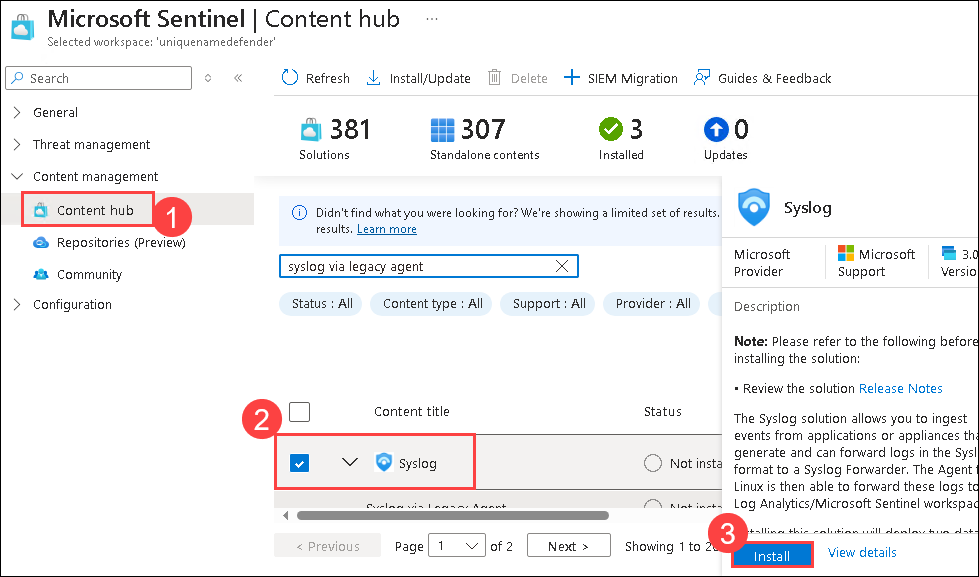  

1. Click on **Data connectors (1)** present under Configuration in the left pane. Select **Syslog via Legacy Agent (2)** connector from the list.

   > **Note:** Refresh if the connector is not visible.

1. Select the **Open connector page (3)** on the connector information blade.

      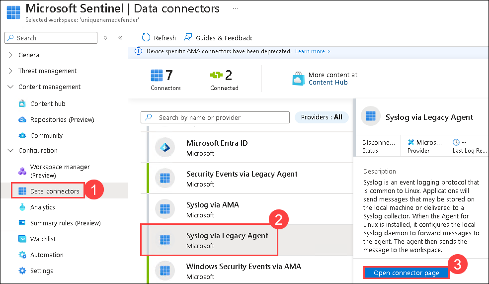  

1. Under **Configuration**, open the **Install agent on a non-Azure Linux Machine** section. Select the link for **Download & install agent for non-Azure Linux machine**. 

      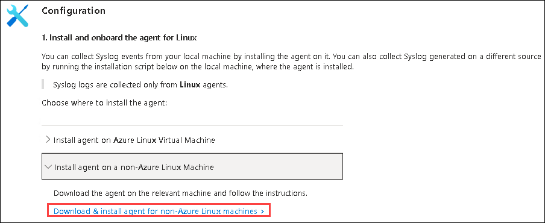  

    >**Note:** Your Log Analytics workspace should show **2 Windows computers connected**. This corresponds to WIN2 and AZWIN01 virtual machines connected earlier.

1. Select the tab for **Linux servers**.

    >**Note:** Your Log Analytics workspace should show **1 Linux computers connected**. This corresponds to the LIN1 (ubuntu1) virtual machine connected earlier with the CEF connector.

1. Select **Log Analytics agent instructions**. Copy the command in the **Download and onboard agent for Linux** area to the clipboard and paste it into the notepad.

      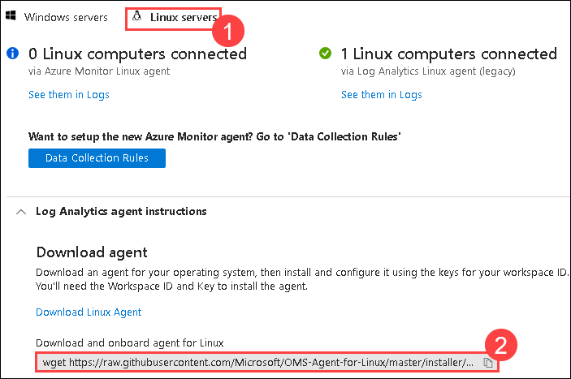  
   
1. Click on **LIN2** Linux virtual machine.

      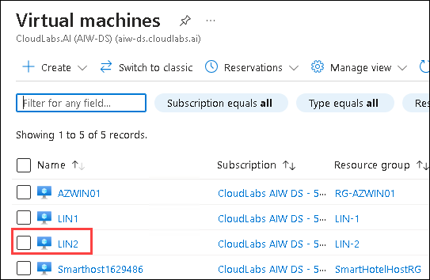  

1. Click on **Connect (1)** from the left navigation pane, scroll down and click on **Select (2)** under the Native SSH.

1. In the Native SSH pop-up window, **copy (3)** the command which is added under Copy and execute SSH command and paste it in a notepad.

      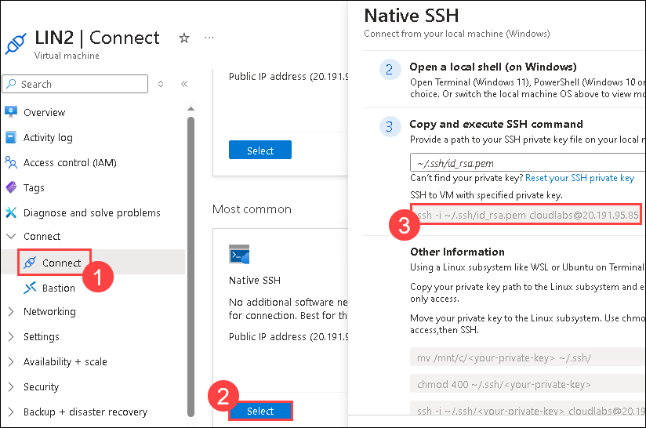  

1. Navigate back to the **WIN1** virtual machine.

1. Launch a NEW Windows PowerShell as Administrator by right-clicking the Start menu icon and selecting **Windows PowerShell (Admin)**. 

1. Paste the command which we copied from the Native SSH window.
   
1. Enter **yes** to confirm the connection and then type the user's **password provided under Resource group: LIN2** in the Environment tab and press enter. Your screen should look something like this:

   

1. Paste the **Download and onboard agent for Linux** from the earlier step. 

1. Once the script is pasted in press enter. The script will run against your Linux server remotely. 

1. Close the Powershell Window.

### Task 3: Configure the facilities you want to collect and their severities for the Syslog connector

   > **Note:** Perform this task from the SmartHotelHost VM (Jump VM).

In this task, you will configure the Syslog collection facilities.

1. In the Search bar of the Azure portal, type **Sentinel**, then select **Microsoft Sentinel**.

1. Click on the **uniquenameDefender (1)** workspace. Click on **Settings (2)** and select **Workspace Settings (3)**.

      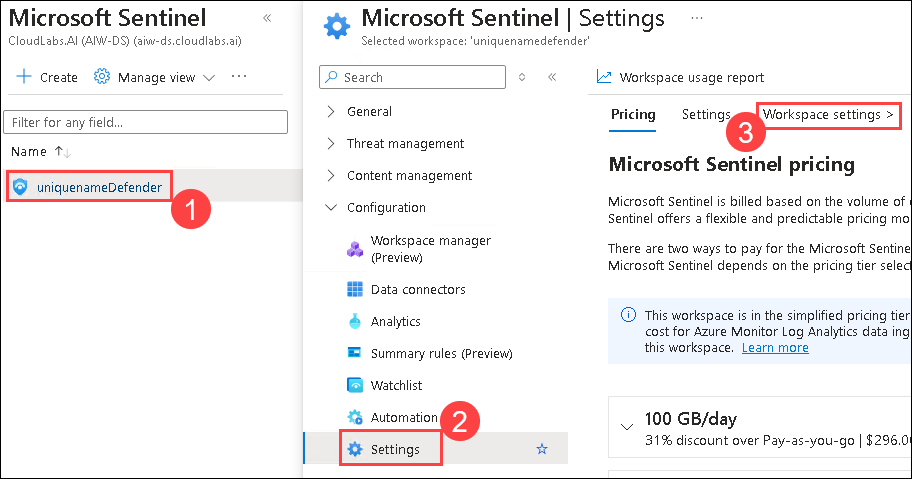 

1. From the left menu, select **Legacy agents management (1)** under the **Classic** area.

1. Click on the **Syslog (2)** tab.

1. Click on the **+ Add facility (3)** button.

1. Select **auth** from the drop-down menu for **Facility name**.

      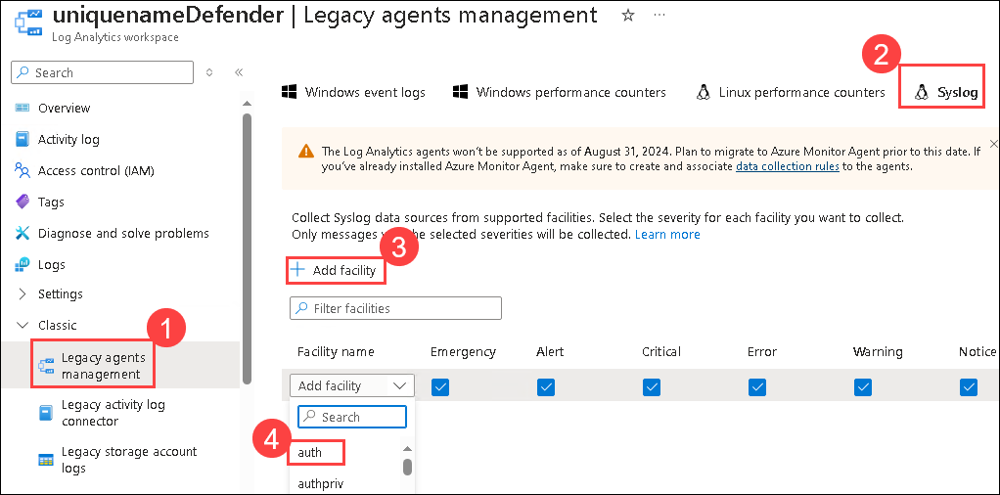 

1. Select the **+ Add facility** button again.

1. Select **authpriv** from the drop-down menu for **Facility name**.

1. Click on **Apply**.

      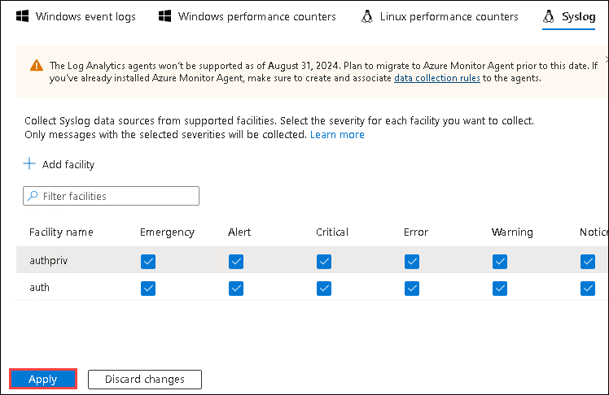    

## Review 
In this lab, you have completed the following:
- Connected a Linux Host using the Common Event Format connector
- Connected a Linux host using the Syslog connector
- Configured the facilities you want to collect and their severities for the Syslog connector

### You have successfully completed this lab!
