# Module 7 - Lab 1 - Exercise 1 - Configure your Microsoft Sentinel environment

## Lab scenario

You're a Security Operations Analyst working at a company that is implementing Microsoft Sentinel. You're responsible for setting up the Microsoft Sentinel environment to meet the company requirements to minimize cost, meet compliance regulations, and provide the most manageable environment for your security team to perform their daily job responsibilities.

>**Important:** The lab exercises for Learning Path #7 are in a *standalone* environment. If you exit the lab before completing it, you will be required to re-run the configurations again.


## Lab objectives
 In this lab, you will perform the following:
- Task 1: Create a Log Analytics Workspace
- Task 2: Deploy Microsoft Sentinel to a workspace
- Task 3: Configure data retention
- Task 4: Create a Watchlist
- Task 5: Create a Threat Indicator
- Task 6: Configure log retention

## Estimated timing: 60 minutes

## Architecture Diagram

  

### Task 1: Create a Log Analytics Workspace

In this task, you will create a Log Analytics workspace for use with Microsoft Defender for Cloud.

1. In the Search bar of the Azure portal, type **Log Analytics**, then select **Log Analytics workspaces**.

   

1. Select **+Create** from the command bar.

   

1. Select Resource Group **RG-Defender**  from the drop down.

1. For the Name, enter **uniquenameDefender**.

1. Select **Review + Create**.

   

1. Once the workspace validation has passed, select **Create**. Wait for the new workspace to be provisioned, this may take a few minutes.

   

### Task 2 - Deploy Microsoft Sentinel to a workspace

In this task, you will deploy Microsoft Sentinel to an existing Log Analytics workspace, enabling it to collect, detect, and respond to security threats.

1. In the Search bar of the Azure portal, type **microsoft sentinel**, then select **Microsoft Sentinel**.

   

1. Select **+Create** from the command bar.

 1. Select the newly created workspace and click on **Add**.
  
    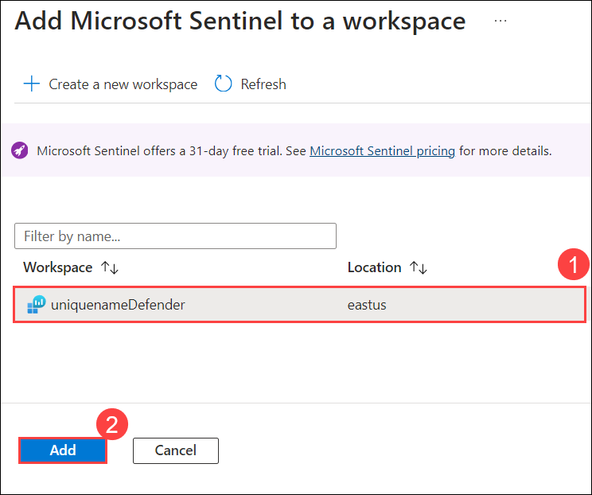

1. Select your Microsoft Sentinel Workspace that you created in the previous lab.

### Task 3 - Configure data retention

1. In the Search bar of the Azure portal, type **Log Analytics**, then select **Log Analytics workspaces**. 

   

1. Select **uniquenameDefender** Log Analytics workspaces. 

1. Expand the *Settings* section in the navigation menu and select **Usage and estimated costs**.

1. Select **Data retention**.

   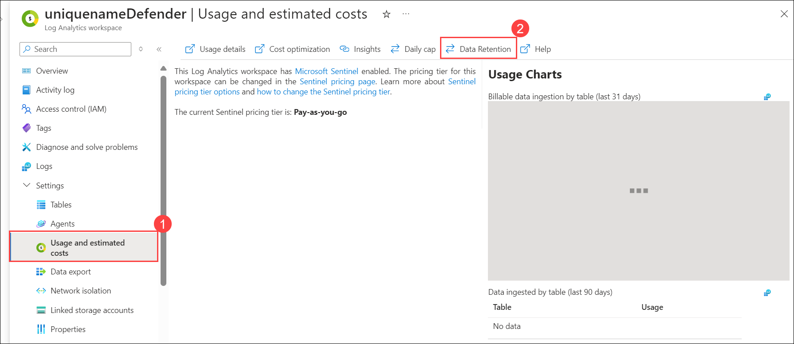

1. Change data retention period to **180 days**.

1. Select **OK**.

   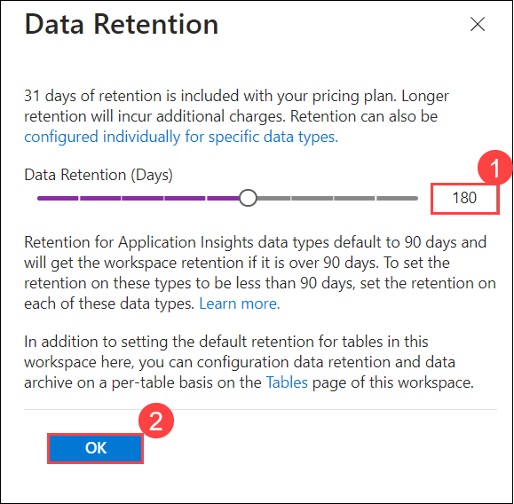

### Task 4: Create a Watchlist

In this task, you will create a watchlist in Microsoft Sentinel.

1. In the search box of your Labvm, enter *Notepad*. Select **Notepad** from the results.

   

1. Type ***Hostname*** then enter for a new line.

1. From row 2 of the notepad, copy the following hostnames, each one in a different line:

    ```Notepad
    Host1
    Host2
    Host3
    Host4
    Host5
    ```

    

1. From the menu select, **File - Save As**.

   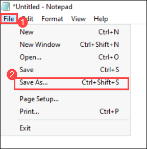

1. Name the file ***HighValue.csv***, change the file type to **All files(*.*)** and select **Save**. 

   

  >**Hint:** The file can be saved in the *Documents* folder.

1. Close Notepad.

1. In the Search bar of the Azure portal, type **microsoft sentinel**, then select **Microsoft Sentinel**.

1. Select **uniquenameDefender** Microsoft Sentinel.

   

1. In Microsoft Sentinel, On the left menu, select the **Watchlist** option under the **Configuration** area.

1. Select **+ New** from the command bar.

   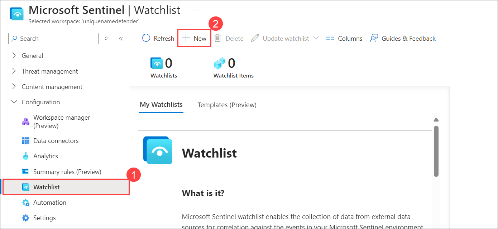

1. In the Watchlist wizard, enter the following:

    |General setting|Value|
    |---|---|
    |Name|**HighValueHosts**|
    |Description|**High Value Hosts**|
    |Alias|**HighValueHosts**|

1. Select, **Next: Source >**.

   

1. Select **Browse for files** under *Upload file* and browse for the *HighValue.csv* file you just created.

    

1. In the ***SearchKey field*** select **Hostname**.

1. Select **Next: Review + Create >**.

    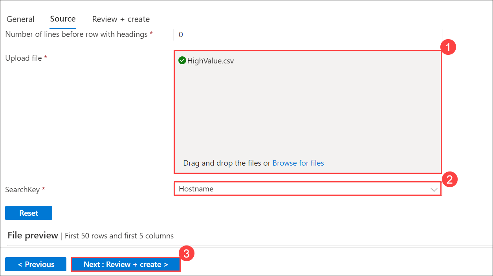

1. Review the settings you entered and select **Create**.

    

1. The screen returns to the Watchlist page.

1. Select the *HighValueHosts* watchlist and on the right pane, select **View in logs**.

     

    >**Important:** It could take up to ten minutes for the watchlist to appear. **Please continue to with the following task and run this command on the next lab**.
    
    >**Note:** You can now use the _GetWatchlist('HighValueHosts') in your own KQL statements to access the list. The column to reference would be *Hostname*.

1. Close the *Logs* window by selecting the 'x' in the top-right. 

    

1. Select **OK** to discard the unsaved edits.

    

   > **Congratulations** on completing the task! Now, it's time to validate it. Here are the steps:
   > - Hit the Validate button for the corresponding task. You can proceed to the next task if you receive a success message.
   > - If not, carefully read the error message and retry the step, following the instructions in the lab guide.
   > - If you need any assistance, please contact us at labs-support@spektrasystems.com. We are available 24/7 to help you out.

  <validation step="53b31791-6d4b-4f83-a56e-b7136bbba6a7" />
  
### Task 5: Create a Threat Indicator

In this task, you will create an indicator in Microsoft Sentinel.

1. In Microsoft Sentinel, On the left menu, select the **Threat intelligence** option in the **Threat management** area.

1. Select **+ Add New** from the command bar.

   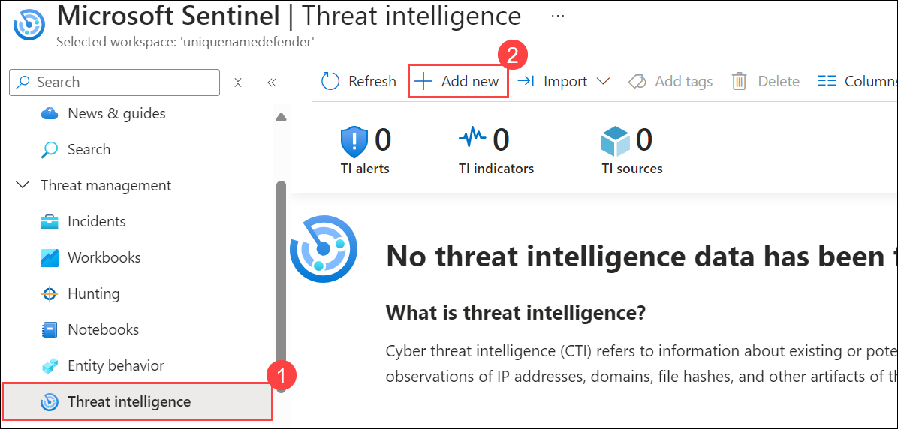

1. Review the different indicator types available in the ***Types*** dropdown. Select the **domain-name**. Enter your initials in the Domain box. You can use **onmicrosoft.com**.

1. For the ***Threat types***, add **malicious-activity** and select **Apply**.

    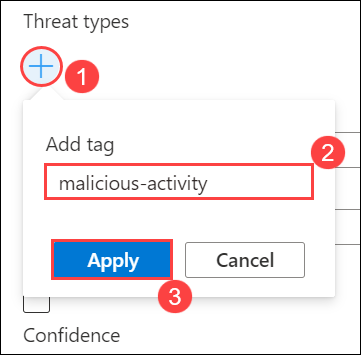

1. For the ***Name***, enter indicator. 

1. Set the **Valid from** field to today's date. and **valid till** to next day.

1. Select **Apply**.

    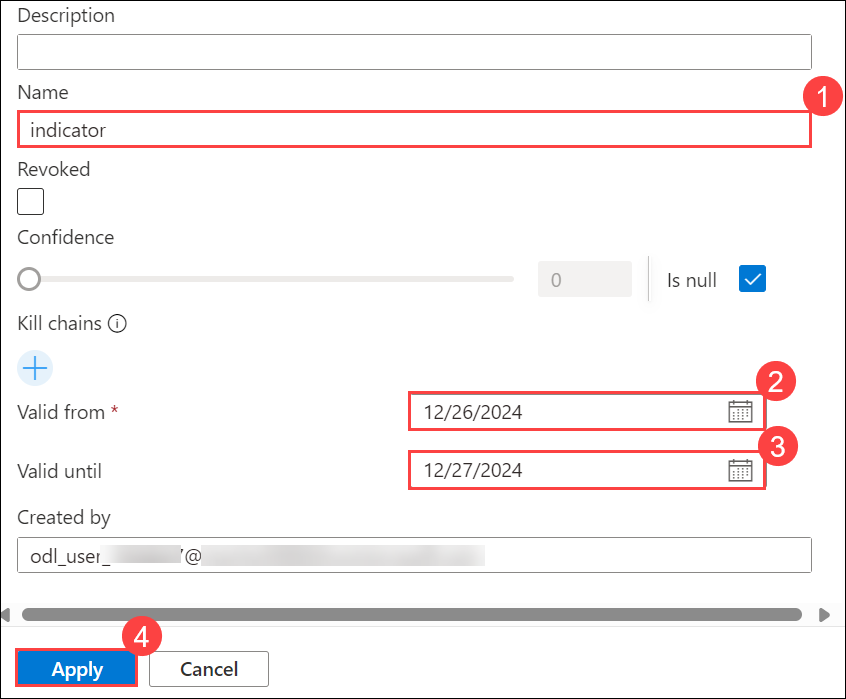

    **Note:** It could take a couple of minutes for the indicator to appear.

1. On the left Menu, Select the **Logs** option in the **General** area. You may need to disable the "Always show queries" option and close the *Queries* window to run the statements.

1. Run the following KQL statement.

    ```KQL
    ThreatIntelligenceIndicator
    ```
    
   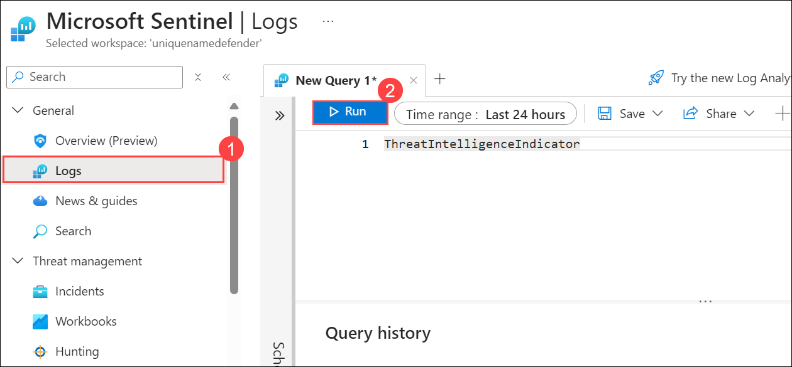

    **Note:** You may need to wait for 20 minutes to get the expected output.

    Scroll the results to the right to see the DomainName column. You can also run the following KQL statement to just see the DomainName column.  

    ```KQL
    ThreatIntelligenceIndicator
    | project DomainName
    ```

   

### Task 6: Configure log retention

In this task, you will change the retention period for the SecurityEvent table.

1. In Microsoft Sentinel, select the **Settings** option under the ***Configuration*** area.

1. Select **Workspace settings**.

   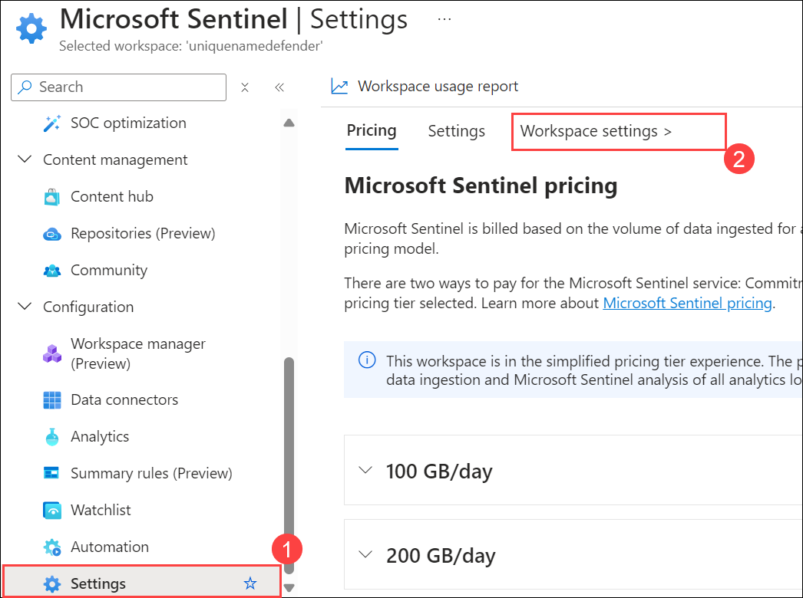

1. In Log Analytics workspace, select the **Tables** option under the ***Settings*** area.

1. Search and select the table **SecurityEvent**, and then right click on ***Security Event*** table.

   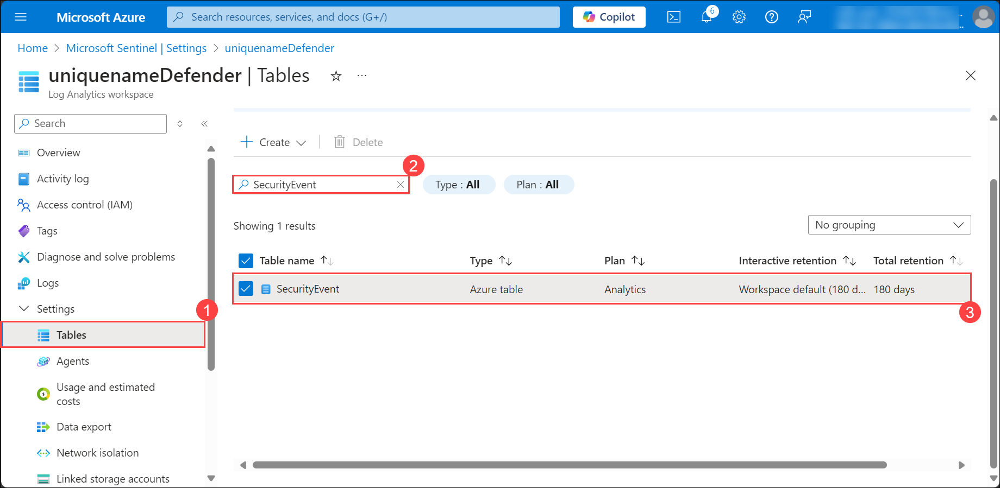

1. Select **Manage Table**.

   

1. Select **180 days** for ***Total retention period***. Notice that ***Archive period*** is only 150 days, since it uses 30 days from the (default) ***Interactive retention***.

1. Select **Save** to apply the changes.

   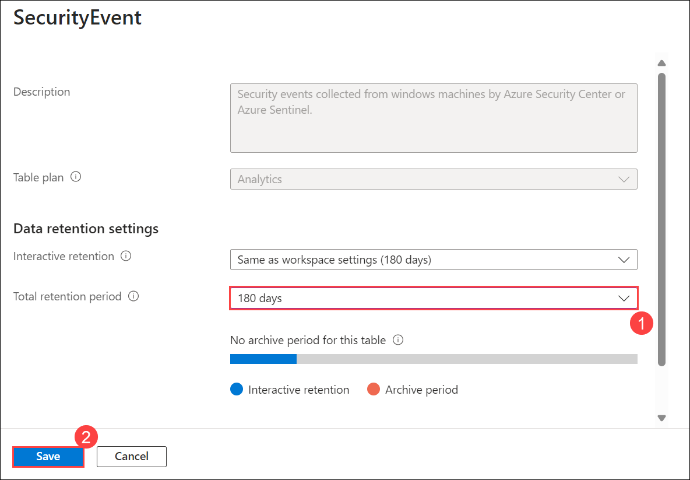

## Review
In this lab, you have completed the following:
- Created a Log Analytics Workspace
- Deployed Microsoft Sentinel to a workspace
- Configured data retention
- Created a Watchlist
- Created a Threat Indicator
- Configured log retention

## You have successfully completed the lab.
