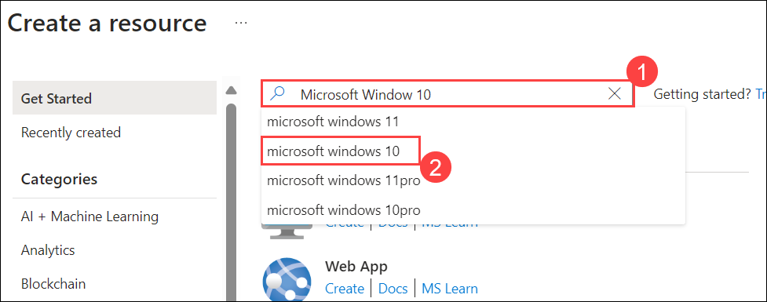
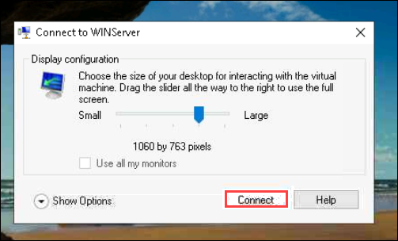
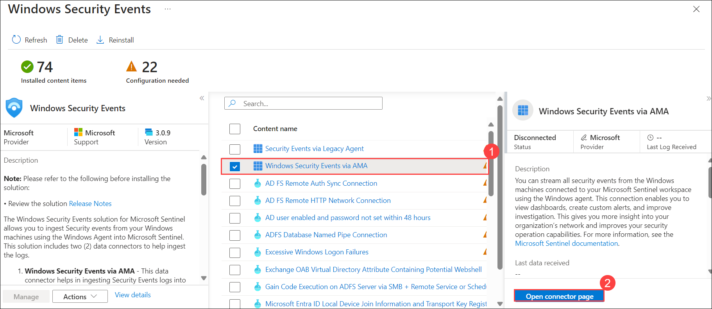

# Module 8 - Lab 1 - Exercise 2 - Connect Windows devices to Microsoft Sentinel using data connectors

## Lab scenario

You're a Security Operations Analyst working at a company that implemented Microsoft Sentinel. You must learn how to connect log data from the many data sources in your organization. The next source of data is Windows virtual machines inside and outside of Azure, like On-Premises environments or other Public Clouds.

>**Important:** The lab exercises for Learning Path #8 are in a *standalone* environment. If you exit the lab before completing it, you will be required to re-run the configurations again.

## Lab objectives
 In this lab, you will perform the following:
- Task 1: Create a Windows Virtual Machine in Azure
- Task 2: Install Azure Arc on an On-Premises Server
- Task 3: Connect an Azure Windows virtual machine
- Task 4: Connect a non-Azure Windows Machine

### Estimated Duration: 30 minutes

## Architecture Diagram

### Task 1: Create a Windows Virtual Machine in Azure

In this task, you'll create a Windows virtual machine in Azure.

1. In the azure portal, Select **+ Create a Resource**. **Hint:** If you were already in the Azure Portal, you might need to select *Microsoft Azure* from the top bar to go Home.

    

1. In the **Search services and marketplace** box, enter *Windows 10 (1)* and select **Microsoft Window 10 (2)** from the drop-down list.

    

1. Select the box for **Microsoft Window 10**.

    

1. Open the *Plan* drop-down list and select **Windows 10 Enterprise, version 22H2 (1)**.

1. Select **Start with a pre-set configuration (2)** to continue.

   

1. Select **Dev/Test** and then select **Continue to create a VM**.

   

1. On **Create a virtual machine** page, configure the disk and then select **Review + create (11)**. 

    | Setting | Value |
    | --- | --- |
    | Subscription | your default subscription **(1)** | 
    | Resource Group | Select **RG-AZWIN01 (2)**   |
    | Virtual machine name |  Enter **AZWIN01 (3)**  | 
    | Region | **<inject key="Region" enableCopy="false" /> (4)** |

      

    | Setting | Value |
    | --- | --- |
    | Image | **Windows 10 Enterprise, version 22H2 (5)**  | 
    | Size| Should be selected as **Standard_B2s**. If it appears empty, select **See all sizes**, choose the **Standard_DS1_v2 (6)** click **Select**. |

      

    | Setting | Value |
    | --- | --- |
    | Username | Enter **azureuser(7)**  |
    | Password  | Enter **Password.1!! (8)**  |
    | Confirm Password  | Enter **Password.1!! (9)** |

      
    
    | Setting | Value |
    | --- | --- |
    | Licensing | Select the Checkbox **(10)** |

     

1. Select **Create**. Wait for the Resource to be created, this may take a few minutes.

    

    >**Note:** If there is a *Networking* validation failure, select that tab, review its contents, and then select **Review + create** again.

### Task 2: Install Azure Arc on an On-Premises Server

In this task, you install Azure Arc on an on-premises server to make onboarding easier.

>**Important:** The next steps are done in a different machine than the one you were previously working. Look for the Virtual Machine name references.

>**Important:** The *Windows Security Events via AMA* data connector requires Azure Arc for non-Azure devices. 

1. In the lab virtual machine, search for **Hyper-V Manager** from task bar and select to open.

    

1. Select **WIN1-<inject key="DeploymentID" enableCopy="false"/> (1)**, then select **WIN2**. Right-click on the **WIN2 (2)** virtual machine and choose **Start**, then click **Continue**. After that, right-click on the **WIN2** virtual machine again and select **Connect (3)**.

    
 
1. Inside **WIN2** Click on **connect**.
 
    

1. Enter the **Password** as `Password.1!!` when prompted then hit on **Enter**.

     

1. Open the Microsoft Edge browser inside **WIN2**.

1. In the **WIN2**, click on the Azure Portal icon as shown below:
 
   .png)

1. In the **Sign in** dialog box, copy and paste **Email/Username: <inject key="AzureAdUserEmail"></inject>** and then select Next.

1. In the **Enter password** dialog box, copy and paste **Password: <inject key="AzureAdUserPassword"></inject>** and then select **Sign in**.

1. In the Search bar of the Azure portal, type **Azure arc (1)**, then select **Azure Arc (2)**.

   

1. In the navigation pane under **Azure Arc resources** select **Machines (1)**

1. Select **+ Add/Create (2)**, then select **Add a machine (3)**.

   

1. Select **Generate script** from the "Add a single server" section.

   

1. In the **Add a server with Azure Arc** page, select the **RG-Defender (2)** Resource group under Project details.
 
1. For *Region*, select **(US) East Us (3)** from the drop-down list.

    

1. Review the Server details and Connectivity method options. Keep the default values and select **Next** to get to the Tags tab.

1. Review the default available tags. Select **Next** to get to the Download and run script tab.

   

1. Scroll down and select the **Download** button. **Hint:** if your browser blocks the download, take action in the browser to allow it.

   

1. In Microsoft Edge Browser, select the ellipsis button (...) if needed and then select **Keep**.

   
    
1. Right-click the Windows Start **(1)** button and select **Windows PowerShell (Admin) (2)**.

   

1. Enter *Administrator* for "Username" and *Passw0rd!* for "Password" if you get a UAC prompt.

1. Enter: cd C:\Users\Administrator\Downloads

    

    >**Important:** If you do not have this directory, most likely means that you are in the wrong machine. Go back to the beginning of Task 4 and change to WINServer and start over.

1. Type *Set-ExecutionPolicy -ExecutionPolicy Unrestricted* and press enter.

1. Enter **A** for Yes to All and press enter.

    

1. Type *.\OnboardingScript.ps1* and press enter. 

    

    >**Important:** If you get the error *"The term .\OnboardingScript.ps1 is not recognized..."*, make sure you are doing the steps for Task 4 in the WINServer virtual machine. Other issue might be that the name of the file changed due to multiple downloads, search for *".\OnboardingScript (1).ps1"* or other file numbers in the running directory.

1. Enter **R** to Run once and press enter (this may take a couple minutes).

    

1. The setup process opens a new Microsoft Edge browser tab to authenticate the Azure Arc agent. Select your admin account, wait for the message "Authentication complete" and then go back to the Windows PowerShell window.

    

1. When the installation finishes, go back to the Azure portal page where you downloaded the script and select **Close**. Close the **Add servers with Azure Arc** to go back to the Azure Arc **Machines** page.

    

1. Select **Refresh** until WINServer server name appears and the Status is *Connected*.
  
    

    >**Note:** This could take a couple of minutes.

### Task 3: Connect an Azure Windows virtual machine

In this task, you'll connect an Azure Windows virtual machine to Microsoft Sentinel.

1. In the Search bar of the Azure portal, type *micdoroft sentinel (1)*, then select **Microsoft Sentinel (2)**.

   

1. Select your Microsoft Sentinel Workspace you created earlier.

   

1. In the Microsoft Sentinel left menus, scroll down to the *Content management* section and select **Content Hub**.

1. In the *Content hub*, search for the **Windows Security Events** solution and select it from the list.

1. On the **Windows Security Events** solution page select **Install**.

    

1. When the installation completes select **Manage**.

    

    >**Note:** The *Windows Security Events* solution installs both the *Windows Security Events via AMA* and the *Security Events via Legacy Agent* Data connectors, along with 2 Workbooks, 20 Analytic Rules, and 43 Hunting Queries.

1. Select the **Windows Security Events via AMA (1)** Data connector, and select **Open connector page (2)** on the connector information blade.

   
    
1. In the *Configuration* section, under the *Instructions* tab, select the **Create data collection rule**.

1. Enter **AZWINDCR** for Rule Name, then select **Next: Resources**.

1. Select **+Add resource(s)** to select the Virtual Machine we created.

1. Expand **RG-AZWIN01**, then select **AZWIN01**.

    

1. Select **Apply** and then select **Next: Collect**.

1. Review the different Security Event collection option. Keep *All Security Events* and then select **Next: Review + create**.

1. Select **Create** to save the Data Collection Rule.

1. Wait a minute and then select **Refresh** to see the new data collection rule listed.

### Task 4: Connect a non-Azure Windows Machine

In this task, you'll add an Azure Arc connected, non-Azure Windows virtual machine to Microsoft Sentinel.  

   >**Note:** The *Windows Security Events via AMA* data connector requires Azure Arc for non-Azure devices.

1. Make sure you are in the **Windows Security Events via AMA** data connector configuration in your Microsoft Sentinel workspace.

1. In the **Instructions** tab, under the *Configuration* section, edit the **AZWINDCR** *data collection rule* by selecting the *pencil* icon.

   
    
1. Select **Next: Resources**, and expand your *Subscription* under *Scope* on the *Resources* tab.

    >**Hint:** You can expand the whole *Scope* hierarchy by selecting the ">" before the *Scope* column.

1. Expand **RG-Defender** (or the Resource Group your created), then select **WIN-xxxxxxxxxx**.

    

    >**Important:** If you do not see it, please refer to Learning Path 8, Exercise 2, Task 2, where you installed Azure Arc on this server.

1. Select **Next: Collect**, then **Next: Review + create**.

   

1. Select **Create** after *Validation passed* is displayed.

> **Congratulations** on completing the task! Now, it's time to validate it. Here are the steps:
> - Hit the Validate button for the corresponding task. You can proceed to the next task if you receive a success message.
> - If not, carefully read the error message and retry the step, following the instructions in the lab guide.
> - If you need any assistance, please contact us at labs-support@spektrasystems.com. We are available 24/7 to help you out.

 <validation step="cb8a9849-e7b9-487e-8717-e483d77a590a" />

## Review
In this lab, you have completed the following:

- Created a Windows Virtual Machine in Azure
- Installed Azure Arc on an On-Premises Server
- Connected an Azure Windows virtual machine
- Connected a non-Azure Windows Machine

## Select **Next** to continue to Lab 3
