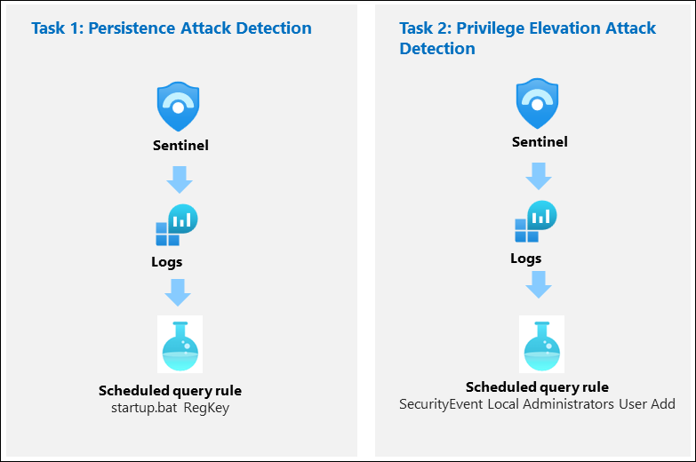
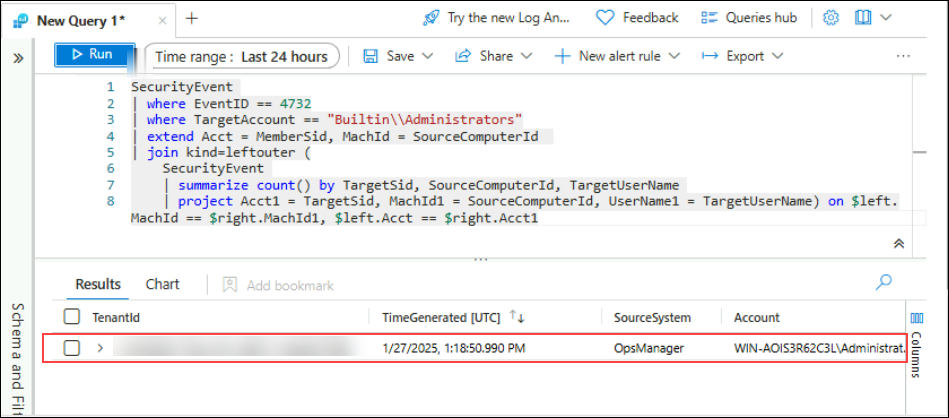

# Module 9 - Lab 1 - Exercise 7 - Create Detections

## Lab scenario

You are a Security Operations Analyst working at a company that implemented Microsoft Sentinel. You are going to work with Log Analytics KQL queries and from there, you will create custom analytics rules to help discover threats and anomalous behaviors in your environment.

Analytics rules search for specific events or sets of events across your environment, alert you when certain event thresholds or conditions are reached, generate incidents for your SOC to triage and investigate, and respond to threats with automated tracking and reMediation processes.

>**Important:** The lab exercises for Learning Path #9 are in a *standalone* environment. If you exit the lab before completing it, you will be required to re-run the configurations again.

## Lab objectives
 In this lab, you will Understand following:
- Task 1: Persistence Attack Detection
- Task 2: Privilege Elevation Attack Detection

## Estimated timing: 30 minutes

## Architecture Diagram

  

### Task 1: Persistence Attack Detection

>**Important:** The next steps are done on a different machine than the one you were previously working on. Look for the Virtual Machine name references.

In this task, you will create a detection for the first attack of the previous exercise.

1. In the Search bar of the Azure portal, type *Sentinel*, then select **Microsoft Sentinel**.

1. Select the Microsoft Sentinel Workspace you created earlier.

1. Select **Logs** from the *General* section.

1. **Run** the following KQL Statement again to recall the tables where we have this data:

    ```KQL
    search "temp\\startup.bat"
    ```
   
    
    >**Note:** A result with the event might take up to 48 hours to appear, if you donot see the logs, you can proceed with the further steps.

1. It is important to help the Security Operations Center Analyst by providing as much context about the alert as you can. This includes projecting Entities for use in the investigation graph. **Run** the following query:

    ```KQL
    SecurityEvent 
    | where Activity startswith "4688" 
    | where Process == "reg.exe" 
    | where CommandLine startswith "REG" 
    | extend timestamp = TimeGenerated, HostCustomEntity = Computer, AccountCustomEntity = SubjectUserName
    ```

1. Now that you have a good detection rule, in the Logs window, select the **+ New alert rule** in the command bar and then select **Create Microsoft Sentinel alert**. This will create a new Scheduled rule. **Hint:** You might need to select the ellipsis (...) button in the command bar.

1. This starts the "Analytics rule wizard". For the *General* tab type:

    |Setting|Value|
    |---|---|
    |Name|Startup RegKey|
    |Description|Startup RegKey in c:\temp|
    |Tactics|Persistence|
    |Severity|High|

1. Select **Next: Set rule logic >** button.

1. On the *Set rule logic* tab, the *Rule query* should be populated already with you KQL query, as well as the entities under *Alert enrichment - Entity mapping*.

    |Entity|Identifier|Data Field|
    |:----|:----|:----|
    |Account|FullName|AccountCustomEntity|
    |Host|Hostname|HostCustomEntity|

1. If **Hostname** isn't selected for *Host* Entity, select it from the drop-down list.

1. For *Query scheduling* set the following:

    |Setting|Value|
    |---|---|
    |Run Query every|5 minutes|
    |Lookup data from the last|1 Days|

    >**Note:** We are purposely generating many incidents for the same data. This enables the Lab to use these alerts.

1. Leave the rest of the options with the defaults. Select **Next: Incident settings>** button.

1. For the *Incident settings* tab, leave the default values and select **Next: Automated response >** button.

1. On the *Automated response* tab under *Automation rules*, select **Add new**.

1. Use the settings in the table to configure the automation rule.

    |Setting|Value|
    |:----|:----|
    |Automation rule name|Startup RegKey|
    |Trigger|When incident is created|
    |Actions |Run playbook|
    |playbook |Defender_XDR_Ransomware_Playbook_for_SecOps-Tasks|

    >**Note:** You have already assigned permissions to the playbook, so it will be available.

1. Select **Apply**

1. Select the **Next: Review + Create >** button.
  
1. On the *Review and create* tab, select the **Save** button to create the new Scheduled Analytics rule.

### Task 2: Privilege Elevation Attack Detection

In this task, you will create a detection for the second attack of the previous exercise.

1. In the Microsoft Sentinel portal, select **Logs** from the General section in case you navigated away from this page.

1. **Run** the following KQL Statement to identify any entry that refers to administrators:

    ```KQL
    search "administrators" 
    | summarize count() by $table
    ```

1. The result might show events from different tables, but in our case, we want to investigate the SecurityEvent table. The EventID and Event that we are looking is "4732 - A member was added to a security-enabled local group". With this, we will identify adding a member to a privileged group. **Run** the following KQL query to confirm:

    ```KQL
    SecurityEvent 
    | where EventID == 4732
    | where TargetAccount == "Builtin\\Administrators"
    ```

1. Expand the row to see all the columns related to the record. The username of the account added as Administrator does not show. The issue is that instead of storing the username, we have the Security IDentifier (SID). **Run** the following KQL to match the SID to the username that was added to the Administrators group:

    ```KQL
    SecurityEvent 
    | where EventID == 4732
    | where TargetAccount == "Builtin\\Administrators"
    | extend Acct = MemberSid, MachId = SourceComputerId  
    | join kind=leftouter (
        SecurityEvent 
        | summarize count() by TargetSid, SourceComputerId, TargetUserName 
        | project Acct1 = TargetSid, MachId1 = SourceComputerId, UserName1 = TargetUserName) on $left.MachId == $right.MachId1, $left.Acct == $right.Acct1
    ```

   

1. Extend the row to show the resulting columns, in the last one, we see the name of the added user under the *UserName1* column we *project* within the KQL query. It is important to help the Security Operations Analyst by providing as much context about the alert as you can. This includes projecting Entities for use in the investigation graph. **Run** the following query:

    ```KQL
    SecurityEvent 
    | where EventID == 4732
    | where TargetAccount == "Builtin\\Administrators"
    | extend Acct = MemberSid, MachId = SourceComputerId  
    | join kind=leftouter (
        SecurityEvent 
        | summarize count() by TargetSid, SourceComputerId, TargetUserName 
        | project Acct1 = TargetSid, MachId1 = SourceComputerId, UserName1 = TargetUserName) on $left.MachId == $right.MachId1, $left.Acct == $right.Acct1
    | extend timestamp = TimeGenerated, HostCustomEntity = Computer, AccountCustomEntity = UserName1
    ```

1. Now that you have a good detection rule, in the Logs window, select **+ New alert rule** in the command bar and then select **Create Microsoft Sentinel alert**. **Hint:** You might need to select the ellipsis (...) button in the command bar.

1. This starts the "Analytics rule wizard". For the *General* tab type:

    |Setting|Value|
    |---|---|
    |Name|**SecurityEvent Local Administrators User Add**|
    |Description|**User added to Local Administrators group**|
    |Tactics|**Privilege Escalation**|
    |Severity|**High**|

1. Select **Next: Set rule logic >** button. 

1. On the *Set rule logic* tab, the *Rule query* should be populated already with you KQL query, as well the entities under *Alert enhancement - Entity mapping*.

    |Entity|Identifier|Data Field|
    |:----|:----|:----|
    |Account|FullName|AccountCustomEntity|
    |Host|Hostname|HostCustomEntity|

1. For *Query scheduling* set the following:

    |Setting|Value|
    |---|---|
    |Run Query every|5 minutes|
    |Lookup data from the last|1 Days|

    >**Note:** We are purposely generating many incidents for the same data. This enables the Lab to use these alerts.

1. Leave the rest of the options with the defaults. Select **Next: Incident settings>** button.

1. For the *Incident settings* tab, leave the default values and select **Next: Automated response >** button.

1. On the *Automated response* tab under *Automation rules*, select **Add new**.

1. Use the settings in the table to configure the automation rule.

   |Setting|Value|
   |:----|:----|
   |Automation rule name|SecurityEvent Local Administrators User Add|
   |Trigger|When incident is created|
   |Actions |Run playbook|
   |playbook |Defender_XDR_Ransomware_Playbook_for_SecOps-Tasks|

   >**Note:** You have already assigned permissions to the playbook, so it will be available.

1. Select **Apply**

1. Select the **Next: Review and create >** button.
  
1. On the *Review and create* tab, select the **Create** button to create the new Scheduled Analytics rule.

## Review
In this lab, you have completed the following:
- Persistence Attack Detection
- Privilege Elevation Attack Detection

## Select **Next** to continue to Lab 8.
