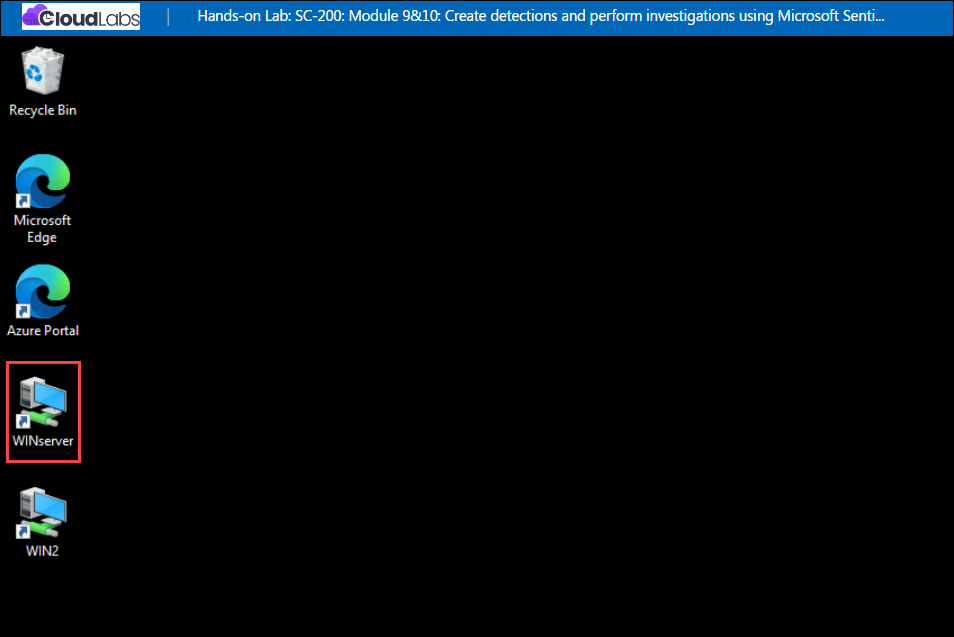
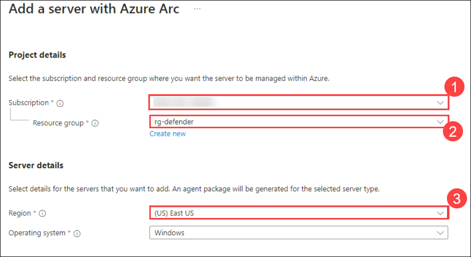
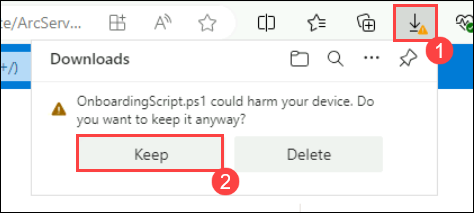
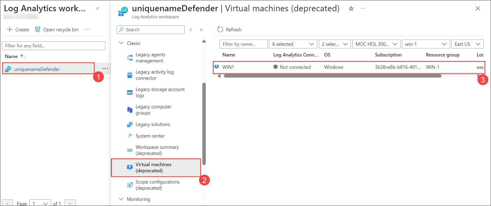
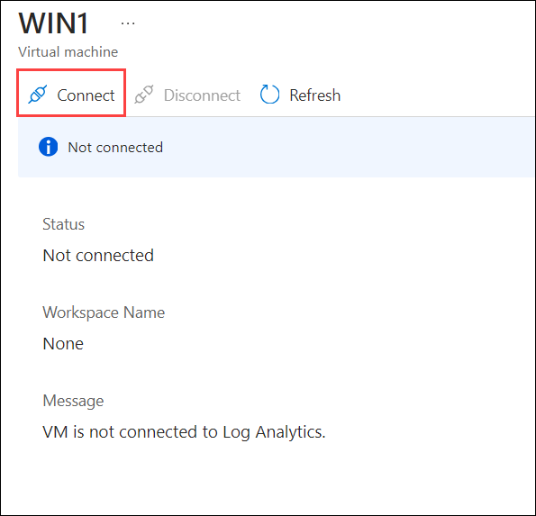
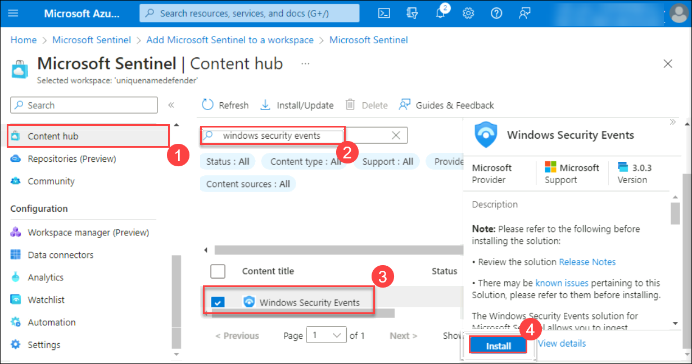
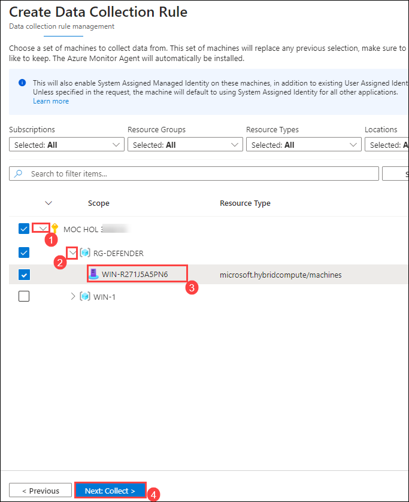

# LAB PREREQUISITES

## Estimated timing: 40 minutes

## Prerequisites to be completed before proceeding to further exercises

### Prerequisite 01

### Task 1: Connect a non-Azure Windows Machine

In this task, you will install Azure Arc and connect a non-Azure Windows virtual machine to Microsoft Sentinel.  

   >**Important:** The next steps are done on a different machine than the one you were previously working on. Look for the Virtual Machine name references.

   >**Important:** The *Windows Security Events via AMA* data connector requires Azure Arc for non-Azure devices. 

1. In the lab virtual machine, Select **WINserver** from the desktop.

   

1. If **Connect to WINServer** prompted, click **Connect.**

       
    
1. Enter the **Password** as `Password.1!!` when prompted.

     

1. Open the Microsoft Edge browser inside **WINSERVER**.

1. On your virtual machine, click on the Azure Portal icon as shown below:
 
     
 
2. You'll see the **Sign into Microsoft Azure** tab. Here, enter your credentials:
 
   - **Email/Username:** <inject key="AzureAdUserEmail"></inject>
 
      
 
3. Next, provide your password:
 
   - **Password:** <inject key="AzureAdUserPassword"></inject>
 
     

1. If you get a pop-up stating **Action Required** click on **Ask Later**.   
   
   
 
4. If prompted to stay signed in, you can click **No**.

    
 
5. If a **Welcome to Microsoft Azure** pop-up window appears, simply click **Cancel** to skip the tour.

   >**Note:** If you are not able to copy-paste the username and password then:
   > - Go to Hyper-V manager.
   > - On the left-right click on **WINSERVER**.
   > - Click on Hyper-V settings.
   > - From there click on allow enhanced mode policy Under **Server** and enable the option.
   > - Again, click on allow enhanced mode under **User** and enable the option. Restart the WINSERVER machine once to reflect the changes.

   >**Note:** If the copy-paste functionality is still not working, copy the content that has to be pasted then from the top navigation pane of the WINSERVER Hyper-V VM click on **Clipboard** and choose **Type Clipboard text** to paste.
      
   > 

1. In the Search bar of the Azure portal, type **Azure arc (1)**, then select **Azure Arc (2)**.

   

1. In the navigation pane under **Azure Arc resources** select **Machines (1)**

1. Select **+ Add/Create (2)**, then select **Add a machine (3)**.

   

1. Select **Generate script** from the "Add a single server" section.

   

1. In the **Add a server with Azure Arc** page, select the **RG-Defender (2)** Resource group under Project details.
 
1. For *Region*, select **(US) East Us (3)** from the drop-down list.

    

1. Review the Server details and Connectivity method options. Keep the default values and select **Next** to get to the Tags tab.

1. Review the default available tags. Select **Next** to get to the Download and run script tab.

   

1. Scroll down and select the **Download** button. **Hint:** if your browser blocks the download, take action in the browser to allow it.

   

1. In Microsoft Edge Browser, select the ellipsis button (...) if needed and then select **Keep**.

   
    
1. Right-click the Windows Start **(1)** button and select **Windows PowerShell (Admin) (2)**.

   

1. Enter *Administrator* for "Username" and *Passw0rd!* for "Password" if you get a UAC prompt.

1. Enter: cd C:\Users\Administrator\Downloads

    

    >**Important:** If you do not have this directory, most likely means that you are in the wrong machine. Go back to the beginning of Task 4 and change to WINServer and start over.

1. Type *Set-ExecutionPolicy -ExecutionPolicy Unrestricted* and press enter.

1. Enter **A** for Yes to All and press enter.

    

1. Type *.\OnboardingScript.ps1* and press enter. 

    

    >**Important:** If you get the error *"The term .\OnboardingScript.ps1 is not recognized..."*, make sure you are doing the steps for Task 4 in the WINServer virtual machine. Other issue might be that the name of the file changed due to multiple downloads, search for *".\OnboardingScript (1).ps1"* or other file numbers in the running directory.

1. Enter **R** to Run once and press enter (this may take a couple minutes).

    

1. The setup process opens a new Microsoft Edge browser tab to authenticate the Azure Arc agent. Select your admin account, wait for the message "Authentication complete" and then go back to the Windows PowerShell window.

    

1. When the installation finishes, go back to the Azure portal page where you downloaded the script and select **Close**. Close the **Add servers with Azure Arc** to go back to the Azure Arc **Machines** page.

    

1. Select **Refresh** until WINServer server name appears and the Status is *Connected*.
  
    

    >**Note:** This could take a couple of minutes.

    >**Note:** **xxxxxxxxxxx** will be a random suffix of the **WIN-**, as demonstrated in the below image. 

     
    
1. In the Azure portal's search bar, type **Log Analytics workplaces** and select **Log analytics workplace** select it.

     

1. Click on **+ Create**.

1. On the **Create Log Analytics workspace** provide the following details and click **Review + Create (4.)**

      - Subscription: Leave the default subscription **(1)**
      - Resource group: Select **RG-DEFENDER (2)**
      - Name: Enter  **uniquenameDefender (3)**

        
        
1. Once the workspace validation has passed, select **Create**. Wait for the new workspace to be provisioned, this may take a few minutes.

1. In the Azure portal's search bar, type **Log Analytics workspaces** and Select the **uniquenameDefender (1)** you just created, click on **Virtual machines (deprecated) (3)** under **classic (3)** from the left panel, then select **WIN1 (4)** virtual machine.

   

1. On the WIN1 page, click on **Connect**.

   

1. Wait until its get connected.

   

1. In the Azure portal's search bar **microsoft sentinel (1)**, type **Microsoft Sentinel (2)** and select it.

     

1. Click on **+ Create**.

1. Next, in Add Microsoft Sentinel to a workspace page select the existing workspace **(1)** that was created in the previous lab, then select **Add (2)**. This could take a few minutes.

     

1. Select the Microsoft Sentinel Workspace you created.
 
1. Click on **Go to the content hub (1)**, search for **Windows Security Events (2)** and select **Windows Security Events (3)**, and click on **Install (4)**.

     

1. Once the installation is completed, go to the data connector (1) page and refresh you should find **Windows Security Events via AMA (2)**.

     

1. Select the **Windows Security Events via AMA** connector and click on **Open connector page** on the connector information blade. 

    >**Note:** You  may have to click on the arrowhead that appears to see the **Open Connector Page Option**

    
 
1. In the **Configuration** section, select the **+Create data collection rule**.

     

1. Enter **WINSERVER (1)** for Rule Name, then select **Next: Resources (2)**.

     

1. Expand the **Subscription (1)** and the **RG-DEFENDER (3)** (or the Resource Group you have created), then select **WIN-xxxx (3)**. Then select **Next: Collect (4)** and **Next: Review + Create**.

     

1. Select **Create**.

1. Wait a few minutes and then select **Refresh** to see the new data collection rule listed.

    > **Congratulations** on completing the task! Now, it's time to validate it. Here are the steps:
   - If you receive a success message, you can proceed to the next task.
   - If not, carefully read the error message and retry the step, following the instructions in the lab guide.
   - If you need any assistance, please contact us at cloudlabs-support@spektrasystems.com. We are available 24/7 to help you out.
 
   <validation step="07c96102-f314-44cd-b6a4-10fbb89a449b" />

**PROCEED TO  THE NEXT EXERCISE**
