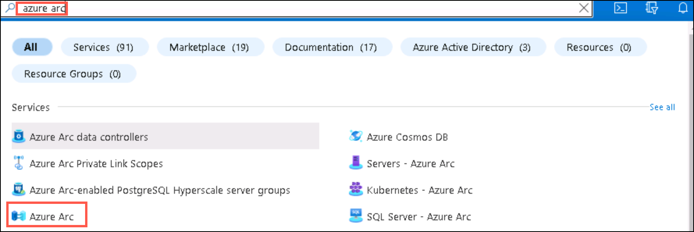
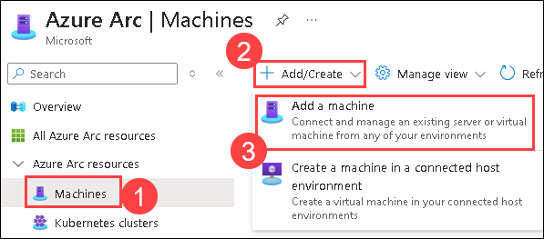
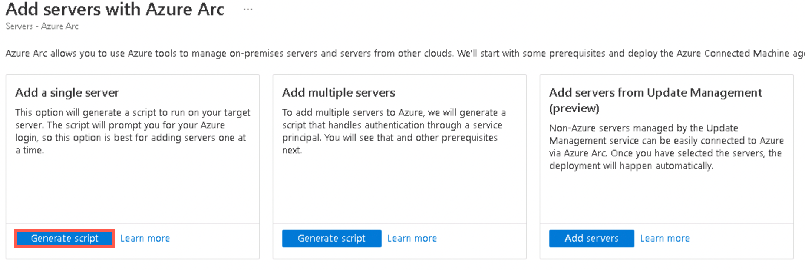

# Lab 01: Onboard Windows Servers to Azure Arc

## Overview

In this lab, you will use Azure Migrate: Discovery and assessment tool that describes how to onboard on-premises Hyper-V VMs to Azure Arc for Azure Management.

Azure Arc allows you to manage your hybrid IT estate with a single pane of glass by extending the Azure management experience to your on-premises servers that are not ideal candidates for migration. 

## Lab Objectives

- Task 1: Onboard On-prem servers to Azure Arc-enabled server

### Task 1: Onboard On-prem servers to Azure Arc-enabled server

In this exercise, you will deploy and configure the Azure Connected Machine agent on a Windows machine hosted outside of Azure, to ensure that it can be managed through Azure Arc-enabled servers.

1. If you are not logged in already, click on the Azure portal shortcut that is available on the desktop and log in with below Azure credentials.

    * Azure Username/Email: <inject key="AzureAdUserEmail"></inject> 
    * Azure Password: <inject key="AzureAdUserPassword"></inject>

1. In the **search resources, services and docs bar**, type **Azure arc** and select it from suggestions, as shown below:
   
    
  
1. On the **Azure Arc** page, select **Machines (1)** under **Azure Arc Resources**, click on **+Add/create (2)** and then **Add a Machine (3)**.
    
    
    
1. In the **Add servers with Azure Arc** page, click **Generate script** under **Add a single server**.

    
    
1. Under the **Basics** tab, fill in the following details:
     
   - Subscription: **Select your subscription**
    
   - Resource group: **SmartHotelHostRG (1)**
  
   - Region: Select **<inject key="Region" enableCopy="false" />**
   
   - Operating system: **Windows (3)**
   
   - Leave other values as default and Click on **Download and run script (4)**

       

1. Under the **Download and run script** tab, **copy (1)** the entire script and paste it into a notepad as it will be used in the further steps and then click on **Close (2)**.

    
    
1. Go to the **Start (1)** button in the VM, search for **Hyper-V Manager (2)** there and select it. 

    

   > **Note:** You can also open the **Hyper-V manager** by clicking on the icon that is present in the taskbar. 
    
1. In Hyper-V Manager, select **HOSTVMS<inject key="DeploymentID" enableCopy="false" />**. 
  
    
    
1. In Hyper-V Manager, select the **AzureArcVM (1)** VM, then select **Start (2)** on the right if not already running.

        
    
1. In Hyper-V Manager, select the **AzureArcVM (1)** VM, then select **Connect (2)** on the right.

      
    
1. In the Connect to AzureArcVM pop-up, click on **Connect** and then log into the VM with the **Administrator password**: **<inject key="SmartHotel Admin Password" />** (the login screen may pick up your local keyboard mapping, use the 'eyeball' icon to check).
 
    
    
1. From the **Start (1)** menu of the AzureArcVM, search for **Windows Powershell (2)** and open it **(3)**.

    
      
1. In PowerShell, run the below command to set the execution policy as unrestricted.

    ```
    Set-ExecutionPolicy -ExecutionPolicy unrestricted
    ```

   > **Note:** Type **Y** when prompted.

1. Now, run the whole script that you copied in the notepad earlier in step 7.

1. After running the script, packages will be installed and then you will be directed to a pop-up browser page to log into your Azure account for authentication purposes. Use the below Azure credentials:

    * Azure Username/Email: <inject key="AzureAdUserEmail"></inject> 
    * Azure Password: <inject key="AzureAdUserPassword"></inject> 

   > **Note:** Move back to the PowerShell pane and now you have connected your AzureArcVM to Azure successfully.
   
   >**Note**: On the Welcome to Microsoft Edge page, select  **Start without your data**, on **Stay current with your browsing data** select **Confirm and continue** and on the help for importing Google browsing data page, select the  **Continue without this data**  button. Then, proceed to select  **Confirm and start browsing**  on the next page has a context menu.
    
    
     
 1. Close the AzureArcVM, navigate to the Azure portal go back to the **Azure Arc** page, select **Machines (1)** under **Infrastructure** and now verify that a server is connected successfully **(2)**.

    **Note:** The name of the new server added could be different. You might have to refresh to see the new server.
    
    
     
     > **Congratulations** on completing the task! Now, it's time to validate it. Here are the steps:
     > - Hit the Validate button for the corresponding task. If you receive a success message, you can proceed to the next task. 
     > - If not, carefully read the error message and retry the step, following the instructions in the lab guide.
     > - If you need any assistance, please contact us at cloudlabs-support@spektrasystems.com. We are available 24/7 to help

     <validation step="7872d02c-327e-400c-bea2-978752ec1e82" />
    
## Summary

In this lab, you explored how to deploy and configure the Azure Connected Machine agent on a Windows machine hosted outside of Azure. You learnt  about creating Azure Arc-enabled servers so that they can manage the Windows machine.

### You have successfully completed the lab!
